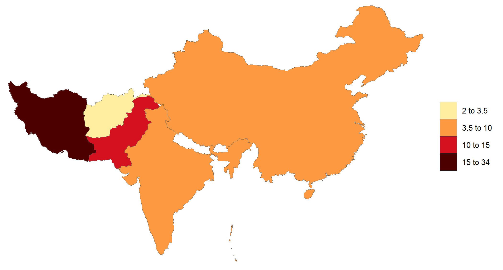
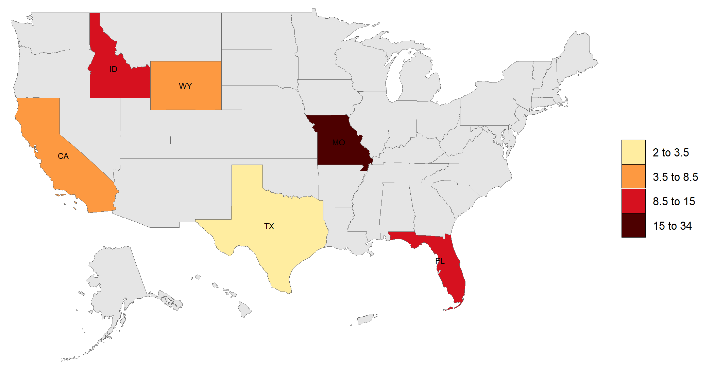

# Summary
`rmap` is an R package that allows uers to easily plot tabular data (csv or R dataframes) on maps without any Geographical Information Systems (GIS) knowledge. All maps produced by `rmap` are `ggplot` objects and thus capitalize on all the flexibility and advancements of the `ggplot2` package [@wickham_ggplot2_2011] and all elements of each map is thus fully customizable. Additionally `rmap` automatically detects and produces comparison maps if the data has multiple scenarios, parameters, classes or time periods as well as animations for time series data. Advanced users can use their own shapefiles if desired. `rmap` comes with a range of prebuilt color palettes but users can also provide any `R` color palette or create their own as needed. Data legends are available in three types of legends which include equal intervals (pretty), kmeans or continuous legend scales to highlight different kinds of data distributions. The input data can be both gridded or polygon data. 

The package is available on github at https://github.com/JGCRI/rmap.

# Statement of need
`rmap` is meant to advance the current state of accessibility to spatial visualization tools in R to users with limited to no GIS knowledge. `rmap` is not meant to be a replacement for spatial manipulation software and focuses on the simple plotting of polygon and gridded data for spatio-temporal visualization of tabular data. Several existing R packages (such as tmap [@tennekes_tmap_2018], cartography [@giraud_cartography_2016], rworldmap [@south_rworldmap_2011], GISTools [@brunsdon_package_2015], choroplethr [@lamstein_choroplethr_2020], sp [@pebesma_s_2005] and sf [@pebesma_simple_2018]) have been developed conduct spatial visualization and analytics in R without depending on external software such as ArcGIS [@esri_arcgis_2020], GRASS [@grass_development_team_grass_2020] or QGIS [@qgis_development_team_qgis_2021]. `rmap` enhances the following key capabilities which are limited in these existing packages:

1. **pre-built maps**: Existing packages come with only a few examples of built-in maps as package data. `rmap` comes with a growing collection of  country, state, mutli-level hydroshed river basin as well as other customized maps that are added into the package data based on user needs and requests. A major reason that existing packages have limited map data is because of package size limitations on popular R package hosting services such as the Comprehensive R Archive Network ([CRAN](https://cran.r-project.org/)). However, having direct acces to a standard set of built-in maps allows for quick deployment and automated search and find of relevant maps without the need for users to have to choose or upload or download the necessary shapefiles. 
2. **direct data table to map**: Existing packages are able to plot a map from a simple data.frame or csv table. `rmap` has an automatic `map_find` function that searches for the appropriate built-in map based on the regions provided in a `subRegion` column. This truly frees users from the need for any other data needs and they can simply `map()` their own data tables directly as long as the table has a minimum of a `subRegion` and `value` column. 
3. **difference maps**: Existing packages do not produce difference maps to compare across scenarios or time periods. `rmap` provides this functionality by automatically recognizing multiple scenarios and time periods to produce difference maps across these dimensions. Often what is most important in spatial data is to see the difference between two scenarios or time periods and `rmap` makes this a seasmless process.
4. **post-process customization**: Existing packages do not produce output objects that can be saved and then customized. Customization of the maps is limited to particular package built-in functionality and arguments. `rmap` produces `ggplot` objects in which every element (axis, grids, titles, colors, linewidths, facets) can all be customized after the map has been produced. This allows users to capitilize on existing knowledge of the widely used `ggplot2` package and its arguments.


# Installation Guide

1. Download and install:
    - R (https://www.r-project.org/)
    - R studio (https://www.rstudio.com/)  
    
    
2. Open R studio:

```r
install.packages("devtools")
devtools::install_github("JGCRI/rmap")
```

Additional steps for UBUNTU from a terminal
```
sudo add-apt-repository ppa:ubuntugis/ppa
sudo apt-get update
sudo apt-get install libudunits2-dev libgdal-dev libgeos-dev libproj-dev libmagick++-dev
```

Additional steps for MACOSX from a terminal
```
brew install pkg-config
brew install gdal
brew install imagemagick@6
```

# Functionality

A detailed [User Guide](https://jgcri.github.io/rmap/articles/vignette_map.html) walks users step-by-step through all the available functionality of `rmap`. A simpler [Cheatsheet](https://jgcri.github.io/rmap/cheatsheet.pdf) is also provided to help users remember some of the key functionality in a single sheet. The following few simple examples demonstrate the simplicity of using `rmap`. Available maps in `rmap` can be found at: https://jgcri.github.io/rmap/articles/vignette_map.html#built-in-maps.

## Plot Country Data

```
library(rmap)

data = data.frame(subRegion = c("Spain","Germany","Austria","Greece","Italy"),
                  value = c(5,10,15,34,2))
map(data)
```



## Compare Scenarios

```
library(rmap)

data = data.frame(subRegion = c("Spain","Germany","Austria","Greece","Italy",
								"Spain","Germany","Austria","Greece","Italy",
								"Spain","Germany","Austria","Greece","Italy"),
                  value = c(5,10,15,34,2,
				           15,50,34,50,20,
						   1,2,7,13,5),
				  scenario = c("scen1","scen1","scen1","scen1","scen1",
							   "scen2","scen2","scen2","scen2","scen2",
							   "scen3","scen3","scen3","scen3","scen3"))
map(data, scenRef = "scen1")
```


## Plot a map on US States

```
library(rmap)

data = data.frame(subRegion = c("CA","FL","ID","MO","TX","WY"),
                  value = c(5,10,15,34,2,7))
map(data)
```


## Plot a map on US States with labels and an under layer

```
library(rmap)

data = data.frame(subRegion = c("CA","FL","ID","MO","TX","WY"),
                  value = c(5,10,15,34,2,7))
map(data, underLayer = mapUS52Compact, crop_to_underLayer = T, labels = T)
```



## Fully customize the output map using ggplot2 arguments

```
library(rmap); library(ggplot2)

data = data.frame(subRegion = c("CA","FL","ID","MO","TX","WY"),
                  value = c(5,10,15,34,2,7))
my_map <- map(data, underLayer = mapUS52Compact, crop_to_underLayer = T, labels = T)

my_map_custom <- my_map[[1]] +
				 theme_dark() +
				 ggtitle("Themes: x label and legend position") +
				 xlab("x label") +
				 theme(legend.position = "bottom",
					   legend.text = element_text(size=12),
					   axis.title.x = element_text(size=12, color="red"))

ggsave("my_map_custom.png")

```


# Acknowledgements
This research was supported by the US Department of Energy, Office of Science, as part of research in MultiSector Dynamics, Earth and Environmental System Modeling Program. The Pacific Northwest National Laboratory is operated for DOE by Battelle Memorial Institute under contract DE-AC05-76RL01830. The views and opinions expressed in this paper are those of the authors alone.

# References
