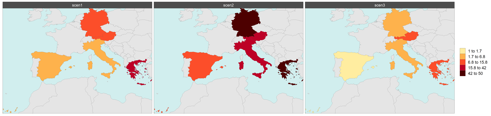

# Summary
`rmap` is an R package that allows users to easily plot tabular data (CSV or R data frames) on maps without any Geographic Information Systems (GIS) knowledge. Maps produced by `rmap` are `ggplot` objects and thus capitalize on the flexibility and advancements of the `ggplot2` package [@wickham_ggplot2_2011] and all elements of each map are thus fully customizable. Additionally `rmap` automatically detects and produces comparison maps if the data has multiple scenarios or time periods as well as animations for time series data. Advanced users can load their own shape files if desired. `rmap` comes with a range of pre-built color palettes but users can also provide any `R` color palette or create their own as needed. Four different legends types are available to highlight different kinds of data distributions. The input spatial data can be both gridded or polygon data. `rmap` is desgined in particular for comparing spatial data across scenarios and time periods and comes preloaded with standard country, state, basin base-maps as well as custom base-maps compatible with the Global Change Analysis Model spatial boundaries (GCAM) [@Calvin:2019]. `rmap` has a growing number of users and its functionality has already been used in several multi-sector dynamics publications [@wild_implications_2021; @wild_integrated_2021; @khan_future_2021] as well as a dependency in other R packages such as `rfasst` [@sampedro_rfasst_2021]. `rmap's` automatic processing of tabular data using pre-built map selection, difference map calculations, faceting, and animations for time periods offers unique functionality which makes it a powerful and yet simple tool for users looking to explore multi-sector, multi-scenario data across space and time.

# Statement of need
`rmap` is meant to help users with limited to no GIS knowledge use R for spatial visualization of tabular spatial data. `rmap` is not meant to be a replacement for spatial manipulation software or detailed cartography and focuses on the simple plotting of polygon and gridded data for spatio-temporal visualization of tabular data with a focus on comparing across scenarios and time periods. Several existing R packages (such as tmap [@tennekes_tmap_2018], cartography [@giraud_cartography_2016], rworldmap [@south_rworldmap_2011], GISTools [@brunsdon_package_2015], choroplethr [@lamstein_choroplethr_2020], sp [@pebesma_s_2005] and sf [@pebesma_simple_2018]) have been developed to conduct spatial visualization and analytics in R without depending on external software such as ArcGIS [@esri_arcgis_2020], GRASS [@grass_development_team_grass_2020] or QGIS [@qgis_development_team_qgis_2021]. `rmap` enhances the following key capabilities which are limited in these existing packages:

1. **Pre-built maps**: Existing packages come with only a few examples of built-in maps as package data. `rmap` comes with a growing collection of  country, state, mutli-level hydroshed river basin as well as other customized maps that are added into the package data based on user needs and requests. A major reason that existing packages have limited map data is because of package size limitations on popular R package hosting services such as the Comprehensive R Archive Network ([CRAN](https://cran.r-project.org/)). However, having direct access to a standard set of built-in maps allows for quick deployment and automated search and find of relevant maps without the need for users to have to choose or upload or download the necessary shape files. 
2. **Direct data table to map**: Existing packages are not able to plot a map directly given only a simple data frame or CSV table. `rmap` has an automatic `map_find` function that searches for the appropriate built-in map based on the regions provided in a `subRegion` column and values in a `value` column. The sub-regions in the `subRegion` column must be one of the sub-regions in the existing set of `rmap` built-in maps. This truly frees users from the need for any other spatial data needs and they can simply `map()` their own data tables directly. 
3. **Difference maps**: Existing packages do not produce difference maps to compare across scenarios or time periods. `rmap` provides this functionality by automatically recognizing multiple scenarios and time periods to produce difference maps across these dimensions. Often what is most important in spatial data is to see the difference between two scenarios or time periods and `rmap` makes this a seamless process.
4. **Post-process customization**: Existing packages do not produce output objects that can be saved and then customized. Customization of the maps is limited to particular package built-in functionality and arguments. `rmap` produces `ggplot` objects in which every element (axis, grids, titles, colors, line widths, facets) can all be customized after the map has been produced. This allows users to capitalize on existing knowledge of the widely used `ggplot2` package and its arguments.

# Functionality

A detailed [User Guide](https://jgcri.github.io/rmap/articles/vignette_map.html) walks users step-by-step through all the available functionality of `rmap`. A simpler [Cheatsheet](https://jgcri.github.io/rmap/cheatsheet.pdf) is also provided to help users remember some of the key functionality in a single sheet. The following few simple examples demonstrate the simplicity of using `rmap`. Available maps in `rmap` can be found at: https://jgcri.github.io/rmap/articles/vignette_map.html#built-in-maps.

## Basic map

```
library(rmap)

data = data.frame(subRegion = c("China","India","Pakistan","Iran","Afghanistan"),
                  value = c(5,10,15,34,2))
map(data)
```


## Map with labels and underlayer

```
library(rmap)

data = data.frame(subRegion = c("CA","FL","ID","MO","TX","WY"),
                  value = c(5,10,15,34,2,7))
map(data, 
	underLayer = mapUS52Compact, 
	crop_to_underLayer = T, 
	labels = T)
```


## Compare Scenarios

```
library(rmap)

data = data.frame(subRegion = c("Spain","Germany","Austria","Greece","Italy",
								"Spain","Germany","Austria","Greece","Italy",
								"Spain","Germany","Austria","Greece","Italy"),
                  value = c(5,10,15,34,2,
				           15,50,34,50,20,
						   1,2,7,13,5),
				  scenario = c("scen1","scen1","scen1","scen1","scen1",
							   "scen2","scen2","scen2","scen2","scen2",
							   "scen3","scen3","scen3","scen3","scen3"))
map(data,
	underLayer = "mapCountries",
	scenRef = "scen1",
	background = T)
```




# Acknowledgements
This research was supported by the US Department of Energy, Office of Science, as part of research in MultiSector Dynamics, Earth and Environmental System Modeling Program. The Pacific Northwest National Laboratory is operated for DOE by Battelle Memorial Institute under contract DE-AC05-76RL01830. The views and opinions expressed in this paper are those of the authors alone.

# References
