<!-------------------------->
<!-------------------------->
# Key Links
<!-------------------------->
<!-------------------------->

- Github: https://github.com/JGCRI/rmap
- Webpage: https://jgcri.github.io/rmap/
- Cheatsheet: https://jgcri.github.io/rmap/rmapCheatsheet.pdf

<!-------------------------->
<!-------------------------->
# Folder Structure & Inputs
<!-------------------------->
<!-------------------------->

<p align="center" style="font-size:18px;"> *Folder structure* </p>
<p align="center"> 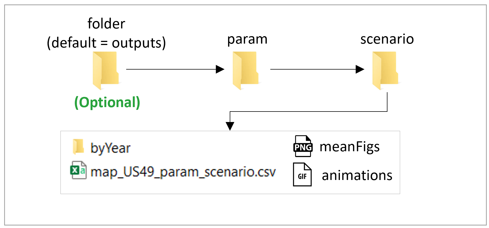</p>

<p align="center" style="font-size:18px;"> *Key inputs* </p>
<p align="center"> 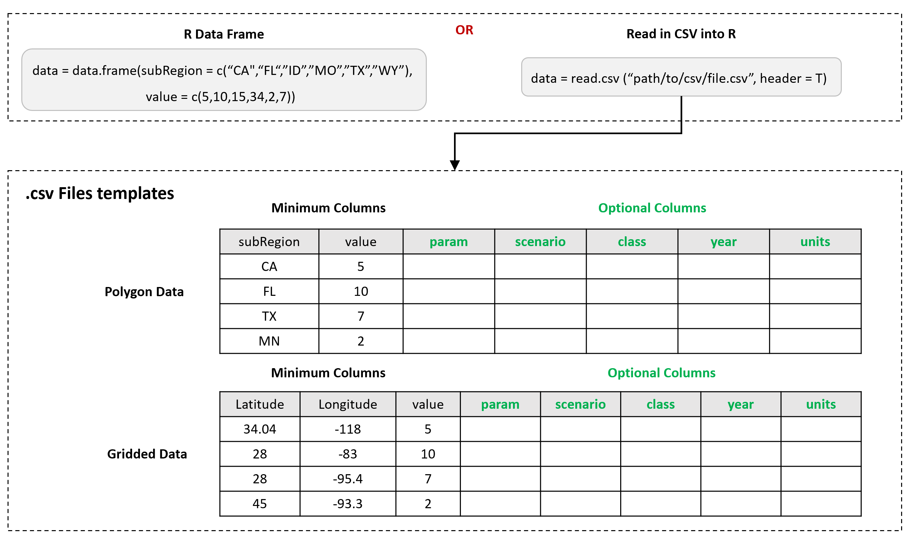</p>


<!-------------------------->
<!-------------------------->
# Maps Available

<!-------------------------->
<!-------------------------->

rmap comes with a set of preloaded maps. A full list of rmap maps is available at in the reference [maps](https://jgcri.github.io/rmap/reference/index.html). The pre-loaded maps all come with each polygon labelled in a **subRegion** column. For each map the data contained in the shapefile and the map itself can be viewed as follows:

```{r, eval=F}
library(rmap)

head(mapUS49@data) # To View data in shapefile
rmap::map(mapUS49, labels=T)

```

<p align="center" style="font-size:18px;"> *Example View of Pre-loaded Map for US49* </p>
<p align="center"> 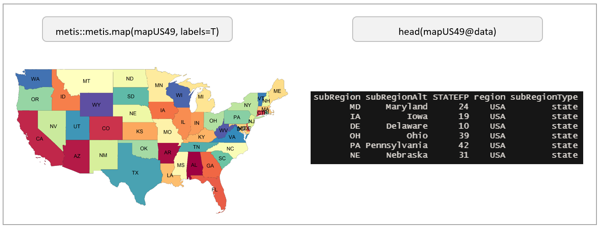</p>


<!-------------------------->
<!-------------------------->
# Plot Data on Maps

<!-------------------------->
<!-------------------------->

## Auto Map Find

`map` will search through the list of [maps](https://jgcri.github.io/rmap/reference/index.html) to see if it can find the "subRegions" provided in the data and then plot the data on those maps. Some examples are provided below:

### US 49

```{r, eval=F}
library(rmap)

data = data.frame(subRegion = c("CA","FL","ID","MO","TX","WY"),
                  x = c(2050,2050,2050,2050,2050,2050),
                  value = c(5,10,15,34,2,7))
map(data,folder = "vignetteMaps", mapTitle = F)
```

<p align="center" style="font-size:18px;"> *US49* </p>
<p align="center"> </p>

<p align="center" style="font-size:18px;"> *US49 Outputs structure* </p>
<p align="center"> 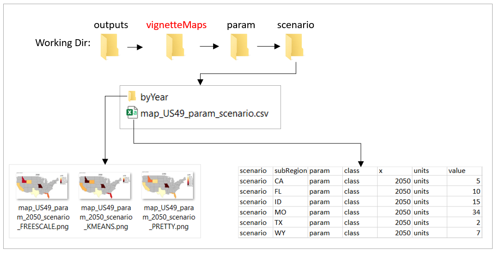</p>


### US 52

```{r, eval=F}
library(rmap)

data = data.frame(subRegion = c("AK","FL","ID","MO","TX","WY"),
                  x = c(2050,2050,2050,2050,2050,2050),
                  value = c(5,10,15,34,2,7))
map(data, folder = "vignetteMaps", mapTitle = F)
```


<p align="center" style="font-size:18px;"> *US52* </p>
<p align="center"> </p>

### US 49 Counties

```{r, eval=F}
library(rmap)

unique(mapUS49County@data$subRegion) # Check subRegion Names
unique(mapUS49County@data$subRegionAlt) # Check Alternate names
data = data.frame(subRegion = c("Pender_NC","Larue_KY","Jim Wells_TX","Orange_IN","Putnam_FL","Ellis_KS"),
                  x = c(2050,2050,2050,2050,2050,2050),
                  value = c(5,10,15,34,2,7))
map(data,
                  folder = "vignetteMaps",
                  nameAppend = "_Alt",
                  mapTitle = F)
```


<p align="center" style="font-size:18px;"> *US49 Counties* </p>
<p align="center"> </p>

### US 52 Counties

```{r, eval=F}
library(rmap)

unique(mapUS52County@data$subRegion) # Check subRegion Names
unique(mapUS52County@data$subRegionAlt) # Check Alternate names
data = data.frame(subRegion = c("Aleutians West_AK","Sabana Grande_PR","Kalawao_HI","Orange_IN","Putnam_FL","Ellis_KS"),
                  x = c(2050,2050,2050,2050,2050,2050),
                  value = c(5,10,15,34,2,7))
map(data,
                  folder = "vignetteMaps",
                  nameAppend = "_Alt",
                  mapTitle = F)
```


<p align="center" style="font-size:18px;"> *US52 Counties* </p>
<p align="center"> </p>

### GCAM 32 Regions


```{r, eval=F}
library(rmap)

unique(mapGCAMBasins@data$subRegion) # Check Available Regions
data = data.frame(subRegion = c("Colombia","China","EU-12","Pakistan","Middle East","Japan"),
                  x = c(2050,2050,2050,2050,2050,2050),
                  value = c(5,10,15,34,2,7))
map(data,
                  folder = "vignetteMaps",
                  mapTitle = F)
```

<p align="center" style="font-size:18px;"> *GCAM 32 Regions* </p>
<p align="center"> </p>

### GCAM Basins

```{r, eval=F}
library(rmap)

unique(mapGCAMBasins@data$subRegion) # Check Available Regions
data = data.frame(subRegion = c("Negro","La_plata","Great","New_England","Indus","Zambezi"),
                  x = c(2050,2050,2050,2050,2050,2050),
                  value = c(5,10,15,34,2,7))
map(data,
                  folder = "vignetteMaps",
                  mapTitle = F)
```

<p align="center" style="font-size:18px;"> *GCAM Basins* </p>
<p align="center"> 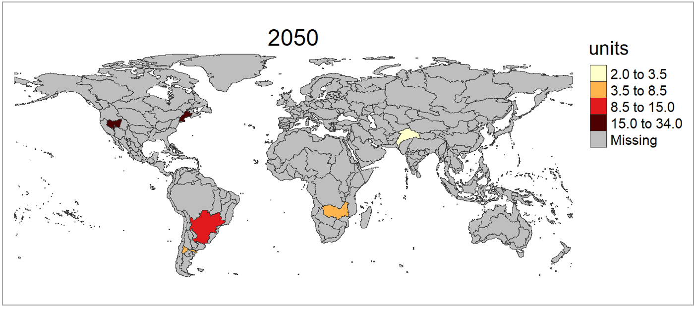</p>


### World Countries


```{r, eval=F}
library(rmap)

unique(mapCountries@data$subRegion) # Check Available Regions
data = data.frame(subRegion = c("Colombia","China","India","Spain","Ghana","Iran"),
                  x = c(2050,2050,2050,2050,2050,2050),
                  value = c(5,10,15,34,2,7))
map(data,
                  folder = "vignetteMaps",
                  mapTitle = F)
```

<p align="center" style="font-size:18px;"> *World Countries* </p>
<p align="center"> </p>

### World States


```{r, eval=F}
library(rmap)

unique(mapStates@data$subRegion) # Check Available Regions
data = data.frame(subRegion = c("Punjab","FL","TX","Faryab","Assam","Lac"),
                  x = c(2050,2050,2050,2050,2050,2050),
                  value = c(5,10,15,34,2,7))
map(data,
                  folder = "vignetteMaps",
                  mapTitle = F)
```

<p align="center" style="font-size:18px;"> *World States* </p>
<p align="center"> </p>

### Gridded Data

```{r, eval=F}
library(rmap); library(dplyr); library(tidyr)

# Load example data set from NASA SEDAC world population and reshape
# https://sedac.ciesin.columbia.edu/data/collection/gpw-v4
grid = rmap::grid_pop_GPWv4To2015 %>% 
  tidyr::gather(key="x", value="value",-lat,-lon) %>%
  dplyr::mutate(units="million",
                value=value/1000000)
  
# Need to assign the gird data to the "grid" argument
map(grid=grid,folder = "vignetteMaps_Grid", mapTitle = F, background=T)
```


## Select Map

Sometimes subRegions can be present on multiple maps. For example "Colombia", China" and "India" are all members of `rmap::mapGCAMReg32` as well as `rmap::mapCountries`. If a user knows which map they want to plot their data on they should specify the map in the `shape` argument.


```{r, eval=F}
library(rmap)

data = data.frame(subRegion = c("Colombia","China","India"),
                  x = c(2050,2050,2050),
                  value = c(5,10,15))

# Auto selection by rmap will choose rmap::mapCountries
map(data,
                  folder = "vignetteChooseMap",
                  mapTitle = F)

# User can specify that they want to plot this data on rmap::mapGCAMReg32
map(data,
                  shape = rmap::mapGCAMReg32,
                  folder = "vignetteChooseMap",
                  nameAppend = "Chosen",
                  mapTitle = F)

```

<p align="center" style="font-size:18px;"> *Select Pre-Loaded Map* </p>
<p align="center"> 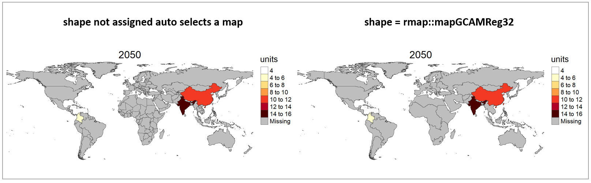</p>


## US 52 Compact

```{r, eval=F}
library(rmap)

data = data.frame(subRegion = c("AK","HI","PR","MO","TX","WY"),
                  x = c(2050,2050,2050,2050,2050,2050),
                  value = c(5,10,15,34,2,7))
map(data,
                  shape = rmap::mapUS52Compact,
                  folder = "vignetteMaps", mapTitle = F)
```

<p align="center" style="font-size:18px;"> *US52Compact* </p>
<p align="center"> </p>

## US 52 Counties Compact

```{r, eval=F}
library(rmap)

unique(mapUS52CountyCompact@data$subRegion) # Check subRegion Names
unique(mapUS52CountyCompact@data$subRegionAlt) # Check Alternate names
data = data.frame(subRegion = c("Aleutians West_AK","Sabana Grande_PR","Kalawao_HI","Orange_IN","Putnam_FL","Ellis_KS"),
                  x = c(2050,2050,2050,2050,2050,2050),
                  value = c(5,10,15,34,2,7))
map(data,
                  shape = rmap::mapUS52CountyCompact,
                  folder = "vignetteMaps",
                  nameAppend = "_Alt",
                  mapTitle = F)
```

<p align="center" style="font-size:18px;"> *US52 Counties Compact* </p>
<p align="center"> </p>


<!-------------------------->
<!-------------------------->
# Create Custom Map Shape

<!-------------------------->
<!-------------------------->

Users can provide map custom shapefiles for their own data if needed. The example below shows how to create a custom shapefile and then plot data on it. 

## Subset existing shape

```{r, eval=F}
library(rmap); library(rgdal)

shapeSubset <- rmap::mapStates # Read in World States shape file
shapeSubset <- shapeSubset[shapeSubset@data$region %in% c("Colombia"),] # Subset the shapefile to Colombia
shapeSubset@data <- droplevels(shapeSubset@data)
shapeSubset@data <- shapeSubset@data %>% dplyr::rename(states=subRegion) # Lets assume the subRegion column was called "states"
map(shapeSubset, fillCol = "states") # View custom shape
head(shapeSubset@data) # review data
unique(shapeSubset@data$states) # Get a list of the unique subRegions

# Plot data on subset
data = data.frame(states = c("Cauca","Valle del Cauca","Antioquia","Córdoba","Bolívar","Atlántico"),
                  x = c(2050,2050,2050,2050,2050,2050),
                  value = c(5,10,15,34,2,7))
map(data,
                  shape = shapeSubset,
                  subRegCol = "states",
                  subRegType = "ColombiaStates",
                  folder = "vignetteMaps_shapeSubset",
                  mapTitle = F)

```


<p align="center" style="font-size:18px;"> *Shape subset* </p>
<p align="center"> 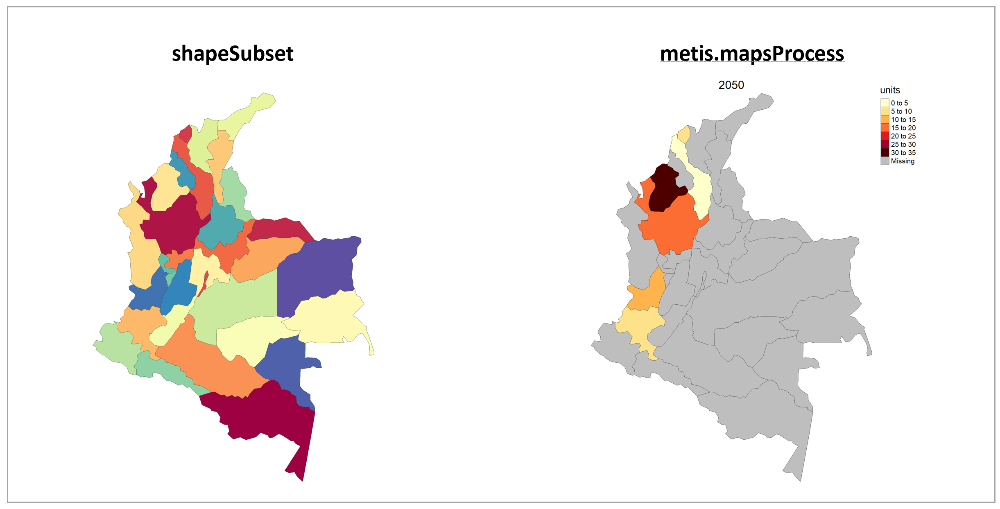</p>

## Crop a shape to another shape

For example if someone wants to analyze counties in Texas.

```{r, eval=F}
library(rmap); library(raster)

shapeSubRegions <- rmap::mapUS49County
shapeCropTo <- rmap::mapUS49
shapeCropTo <- shapeCropTo[shapeCropTo@data$subRegion %in% c("TX"),]
shapeCropTo@data <- droplevels(shapeCropTo@data)
shapeCrop<- sp::spTransform(shapeCropTo,raster::crs(shapeSubRegions))
shapeCrop <-raster::crop(shapeSubRegions,shapeCropTo)
shapeCrop@data <- shapeCrop@data%>%dplyr::select(subRegion)
shapeCrop$subRegion%>%unique() # Check subRegion names
map(shapeCrop)

# Plot data on subset
data = data.frame(county = c("Wise_TX","Scurry_TX","Kendall_TX","Frio_TX","Hunt_TX","Austin_TX"),
                  x = c(2050,2050,2050,2050,2050,2050),
                  value = c(5,10,15,34,2,7))
map(data,
                  shape = shapeCrop,
                  subRegCol = "county",
                  subRegType = "TexasCounties",
                  folder = "vignetteMaps_shapeCrop",
                  mapTitle = F)

```

<p align="center" style="font-size:18px;"> *Shape Crop* </p>
<p align="center"> 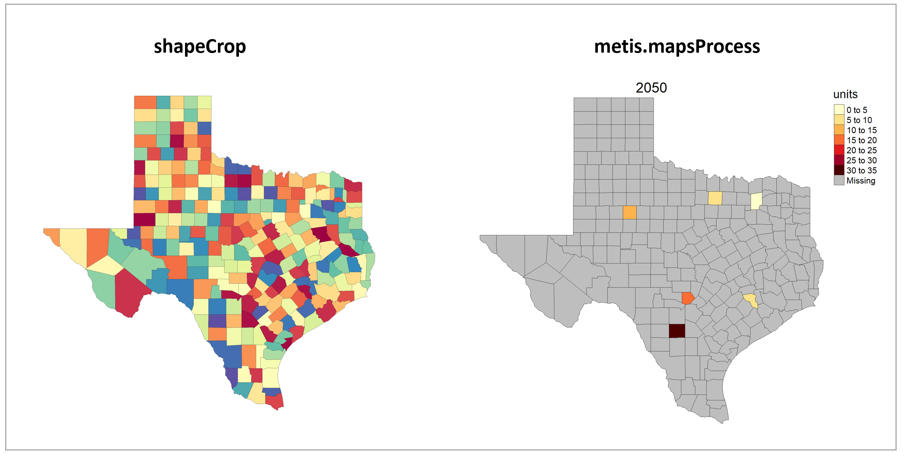</p>

<!-------------------------->
<!-------------------------->
# Crop to Boundary

<!-------------------------->
<!-------------------------->

By setting the **cropToBoundary** argument to **T** the function will crop your map to the regions with data provided. This is particularly helpful for data plotted on the world maps as shown in the example below:

```{r, eval=F}
library(rmap)
data = data.frame(subRegion = c("India","China"), year = c(2010,2010),value = c(32,54))
map(data = data, mapTitle = F, folder = "vignetteMaps", cropToBoundary=F, )
map(data = data, mapTitle = F, folder = "vignetteMaps", cropToBoundary=T, 
                  nameAppend="Cropped")
```


<p align="center" style="font-size:18px;"> *Crop to Boundary* </p>
<p align="center"> </p>

<!-------------------------->
<!-------------------------->
# Plot Background

<!-------------------------->
<!-------------------------->

By turning on **background** a background layer will be added to any shape map.

```{r, eval=F}
library(rmap)
data = data.frame(subRegion = c("India","China"), year = c(2010,2010), value = c(32,54))
map(data = data, mapTitle = F, folder = "vignetteMaps", 
                  cropToBoundary = T,
                  background = T, nameAppend = "Extended")

# Can increase the extnded boundaries by using expandPercent
map(data = data, mapTitle = F, folder = "vignetteMaps", 
                  cropToBoundary = T,
                  background = T, nameAppend = "Extended10", expandPercent = 50)
```

<p align="center" style="font-size:18px;"> *Extended Background* </p>
<p align="center"> 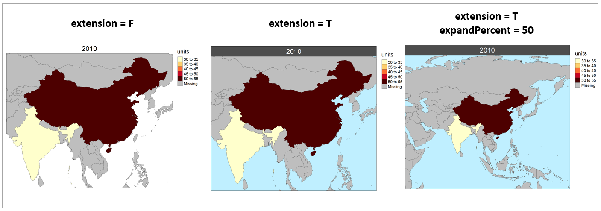</p>

<!-------------------------->
<!-------------------------->
# Multi-Year & Animations

<!-------------------------->
<!-------------------------->

```{r, eval=F}
library(rmap)
data = data.frame(subRegion = c("Austria","Spain", "Italy", "Germany","Greece",
                                "Austria","Spain", "Italy", "Germany","Greece",
                                "Austria","Spain", "Italy", "Germany","Greece",
                                "Austria","Spain", "Italy", "Germany","Greece"),
                  year = c(rep(2025,5),
                               rep(2050,5),
                               rep(2075,5),
                               rep(2100,5)),
                  value = c(32, 38, 54, 63, 24,
                            37, 53, 23, 12, 45,
                            23, 99, 102, 85, 75,
                            12, 76, 150, 64, 90))
map(data = data, folder ="multiYear", 
                  cropToBoundary=T, background = T )
```


<p align="center" style="font-size:18px;"> *Multi-year* </p>
<p align="center"> 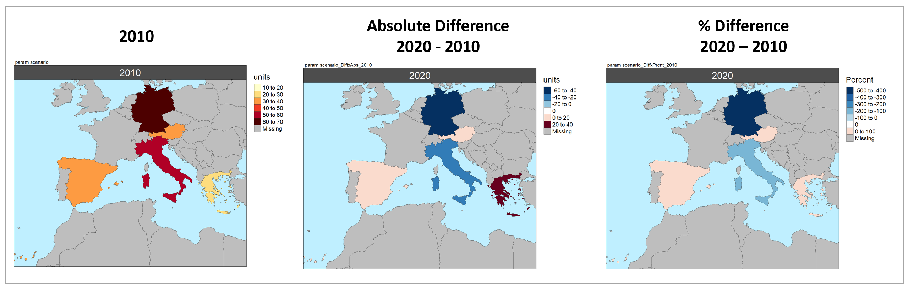</p>

<p align="center" style="font-size:18px;"> *Multi-year Animation* </p>
<p align="center"> </p>


<!-------------------------->
<!-------------------------->
# Multi-Class

<!-------------------------->
<!-------------------------->

```{r, eval=F}
library(rmap)
data = data.frame(subRegion = c("Austria","Spain", "Italy", "Germany","Greece",
                                "Austria","Spain", "Italy", "Germany","Greece",
                                "Austria","Spain", "Italy", "Germany","Greece",
                                "Austria","Spain", "Italy", "Germany","Greece"),
                  class = c(rep("municipal",5),
                               rep("industry",5),
                               rep("agriculture",5),
                               rep("transport",5)),
                  year = rep(2010,20),
                  value = c(32, 38, 54, 63, 24,
                            37, 53, 23, 12, 45,
                            23, 99, 102, 85, 75,
                            12, 76, 150, 64, 90))
map(data = data, folder ="multiClass", 
                  cropToBoundary = T, background = T )
```


<p align="center" style="font-size:18px;"> *Multi-class* </p>
<p align="center"> </p>


<!-------------------------->
<!-------------------------->
# Multi-Scenario Diff plots

<!-------------------------->
<!-------------------------->

With multiple scenarios assigning a **scenRef** calculates the absolute and percentage difference between the different scenarios and stores them in corresponding folders.

```{r, eval=F}
library(rmap)
data = data.frame(subRegion = c("Austria","Spain", "Italy", "Germany","Greece",
                                "Austria","Spain", "Italy", "Germany","Greece",
                                "Austria","Spain", "Italy", "Germany","Greece"),
                  scenario = c("scen1","scen1","scen1","scen1","scen1",
                               "scen2","scen2","scen2","scen2","scen2",
                               "scen3","scen3","scen3","scen3","scen3"),
                  year = rep(2010,15),
                  value = c(32, 38, 54, 63, 24,
                            37, 53, 23, 12, 45,
                            40, 44, 12, 30, 99))
map(data = data, folder ="multiScenario", 
                  cropToBoundary = T, background = T, scenRef = "scen1", scenDiff = c("scen3"))
```

<p align="center" style="font-size:18px;"> *Multi-Scenario Combined Plot* </p>
<p align="center"> 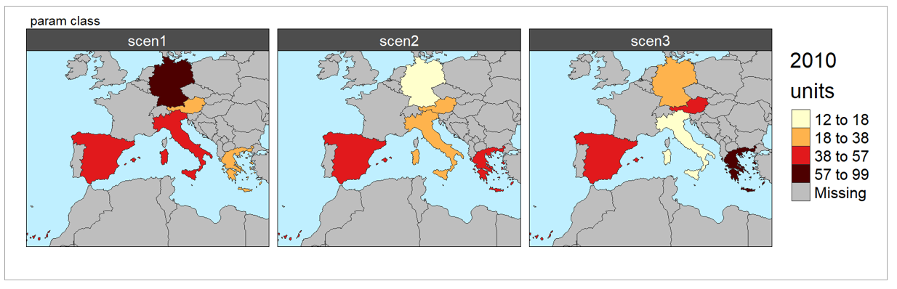</p>

<p align="center" style="font-size:18px;"> *Multi-Scenario Diff* </p>
<p align="center"> </p>

<p align="center" style="font-size:18px;"> *Multi-Scenario Diff Folders* </p>
<p align="center"> 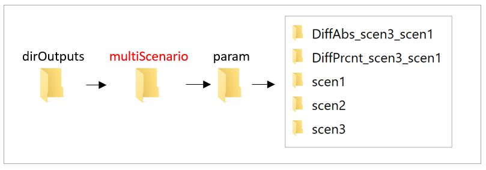</p>


<!-------------------------->
<!-------------------------->
# Multi-Year Diff plots

<!-------------------------->
<!-------------------------->

With multiple years assigning a **xRef** calculates the absolute and percentage difference between the different years and stores them in corresponding folders.

```{r, eval=F}
library(rmap)
data = data.frame(subRegion = c("Austria","Spain", "Italy", "Germany","Greece",
                                "Austria","Spain", "Italy", "Germany","Greece",
                                "Austria","Spain", "Italy", "Germany","Greece"),
                  year = c(rep(2010,5),rep(2020,5),rep(2030,5)),
                  value = c(32, 38, 54, 63, 24,
                            37, 53, 23, 12, 45,
                            40, 45, 12, 50, 63))
map(data = data, folder = "multiYear", 
                  cropToBoundary = T, background = T, xRef = 2010, xDiff = c(2020))
```


<p align="center" style="font-size:18px;"> *Multi-Year Diff* </p>
<p align="center"> </p>

<p align="center" style="font-size:18px;"> *Multi-Year Diff Folders* </p>
<p align="center"> 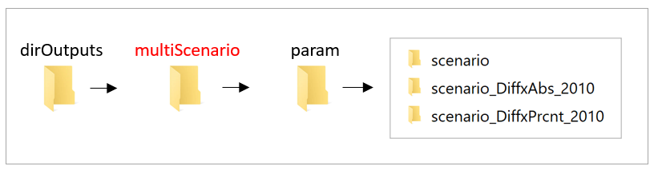</p>

<!-------------------------->
<!-------------------------->
# Scale Range

<!-------------------------->
<!-------------------------->

```{r, eval=F}
library(rmap)
data = data.frame(subRegion = c("Austria","Spain", "Italy", "Germany","Greece",
                                "Austria","Spain", "Italy", "Germany","Greece"),
                  scenario = c("scen1","scen1","scen1","scen1","scen1",
                               "scen2","scen2","scen2","scen2","scen2"),
                  year = rep(2010,10),
                  value = c(32, 38, 54, 63, 24,
                            37, 53, 23, 12, 45))
map(data = data, folder = "scaleRange", 
                  cropToBoundary = T, background = T, scenRef = "scen1", 
                  scaleRange = c(0,50), scaleRangeDiffAbs = c(-100,100), scaleRangeDiffPrcnt = c(-60,60))
```


<p align="center" style="font-size:18px;"> *Scale Range* </p>
<p align="center"> </p>


<!-------------------------->
<!-------------------------->
# Color Palettes

<!-------------------------->
<!-------------------------->

Can use any [R color palette](https://www.nceas.ucsb.edu/sites/default/files/2020-04/colorPaletteCheatsheet.pdf) or choose from a list of colors from the [jgcricolors package](https://jgcri.github.io/jgcricolors/articles/vignette_examples.html).

```{r, eval=F}
library(rmap)
data = data.frame(subRegion = c("Austria","Spain", "Italy", "Germany","Greece",
                                "Austria","Spain", "Italy", "Germany","Greece"),
                  scenario = c("scen1","scen1","scen1","scen1","scen1",
                               "scen2","scen2","scen2","scen2","scen2"),
                  year = rep(2010,10),
                  value = c(32, 38, 54, 63, 24,
                            37, 53, 23, 12, 45))
map(data = data, folder ="colorPalettes", 
                  cropToBoundary = T, background = T, scenRef = "scen1",
                  classPalette = "pal_wet", classPaletteDiff = "pal_div_BrGn")

```


<p align="center" style="font-size:18px;"> *Color Palettes* </p>
<p align="center"> </p>

<!-------------------------->
<!-------------------------->
# Legend Customization

<!-------------------------->
<!-------------------------->

There are several options to customize your legend as shown below:

<!-------------------------->
## Legend Position
<!-------------------------->

### Single Facet Maps

* Change the legend position to be inside or outside using ```legendOutsideSingle = T```
* Modify the ```legendPosition = c('right','top')``` argument to change the position of all inside legends.
* Modify the ```legendOutsidePosition = "left" # "right","left"``` argument to change the position of all outside legends.


```{r, eval=F}
library(rmap)
data = data.frame(subRegion = c("Austria","Spain", "Italy", "Germany","Greece"),
                  year = rep(2010,5),
                  value = c(32, 38, 54, 63, 24))

map(data = data, folder ="legendCustomization", 
                  cropToBoundary = T, background = T,
                  legendOutsideSingle = T,
                  legendOutsidePosition = "left",
                  #legendPosition = NULL,
                  nameAppend="_legendOutsideLeft")

map(data = data, folder ="legendCustomization",
                  cropToBoundary = T, background = T,
                  legendOutsideSingle = F,
                  #legendOutsidePosition = NULL,
                  legendPosition = c('left','bottom'),
                  nameAppend="_legendInsideBottomLeft")

```


<p align="center" style="font-size:18px;"> *Legend Position - Single Facet Maps* </p>
<p align="center"> 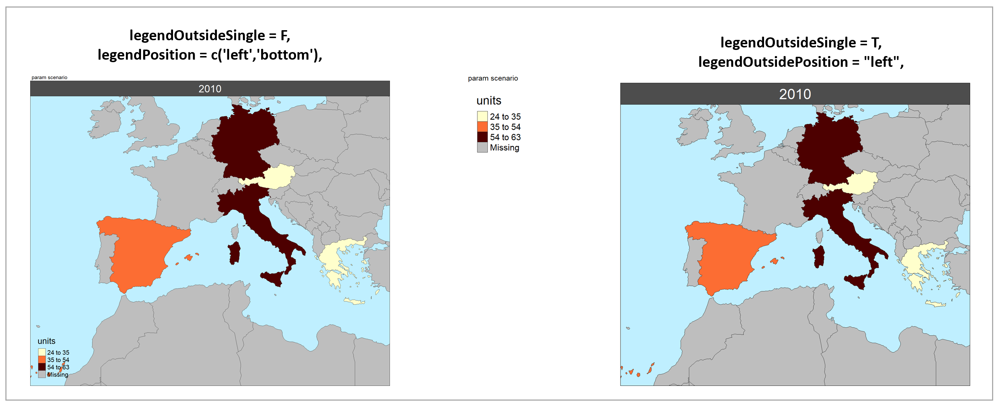</p>


### Multi-faceted maps:

* FREESCALE will always have legends inside the maps because these will always be different for each facet
* For PRETTY and KMEANS legends will always be outside
* So you can set the position of outside and inside legend positions together.
* Modify the ```legendPosition = c('right','top')``` argument to change the position of all inside legends.
* Modify the ```legendOutsidePosition = "left" # "right","left"``` argument to change the position of all outside legends.


```{r, eval=F}
library(rmap)
data = data.frame(subRegion = c("Austria","Spain", "Italy", "Germany","Greece",
                                "Austria","Spain", "Italy", "Germany","Greece",
                                "Austria","Spain", "Italy", "Germany","Greece",
                                "Austria","Spain", "Italy", "Germany","Greece"),
                  class = c(rep("municipal",5),
                               rep("industry",5),
                               rep("agriculture",5),
                               rep("transport",5)),
                  year = rep(2010,20),
                  value = c(32, 38, 54, 63, 24,
                            37, 53, 23, 12, 45,
                            23, 99, 102, 85, 75,
                            12, 76, 150, 64, 90))
map(data = data, folder ="legendCustomization", 
                  cropToBoundary = T, background = T,
                  legendOutsidePosition = "left",
                  legendPosition =  c('left','bottom'),
                  nameAppend = "_legendOutsideLeftInsideBottomLeft")
```

<p align="center" style="font-size:18px;"> *Legend Customization - Multi Facet Maps* </p>
<p align="center"> 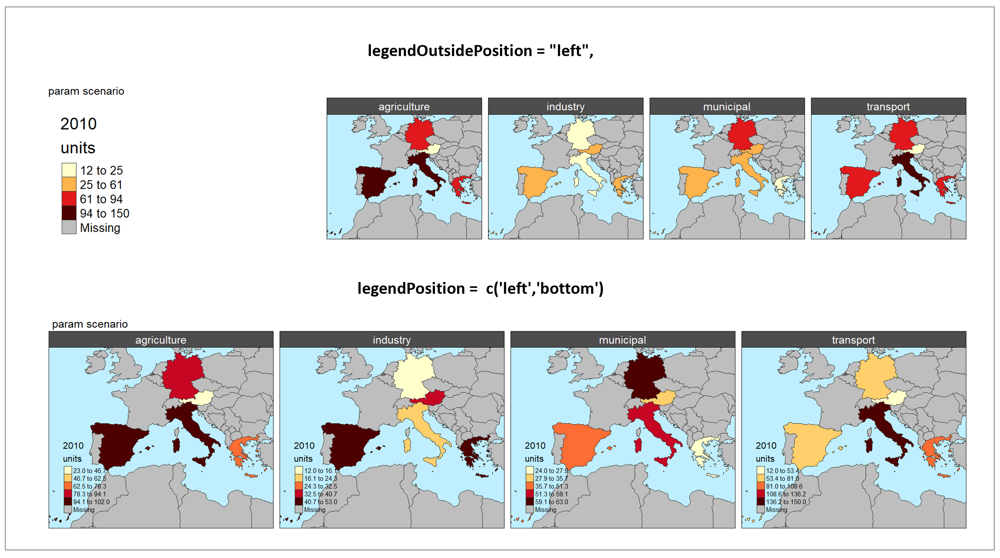</p>

<!-------------------------->
## Legend Breaks Number
<!-------------------------->


* Number of legend breaks can be set using the ```legendBreaksn``` variable.
* "Pretty" legends will choose the number of breaks closest to the value of ```legendBreaksn``` while ensuring "pretty" number distributions.
* "Freescale" legends will set the number of breaks to exactly the value chosen for ```legendBreaksn```
* "Kmeans" will ignore the value chosen for ```legendBreaksn```since it calculates the best breaks it self to highlight the distribution of the data.
* The ```legendBreaksn``` will apply in the same way to Diff Plots.


```{r, eval=F}
library(rmap)
data = data.frame(subRegion = c("Austria","Spain", "Italy", "Germany","Greece"),
                  year = rep(2010,5),
                  value = c(32, 38, 54, 63, 24))

map(data = data, folder ="legendCustomization",
                  cropToBoundary = T, background = T,
                  legendBreaksn=9,
                  nameAppend="_legendBreaks9")

map(data = data, folder ="legendCustomization",
                  cropToBoundary = T, background = T,
                  legendBreaksn=3,
                  nameAppend="_legendBreaks3")

```


<p align="center" style="font-size:18px;"> *Legend Customization - Legend Breaks Number* </p>
<p align="center"> 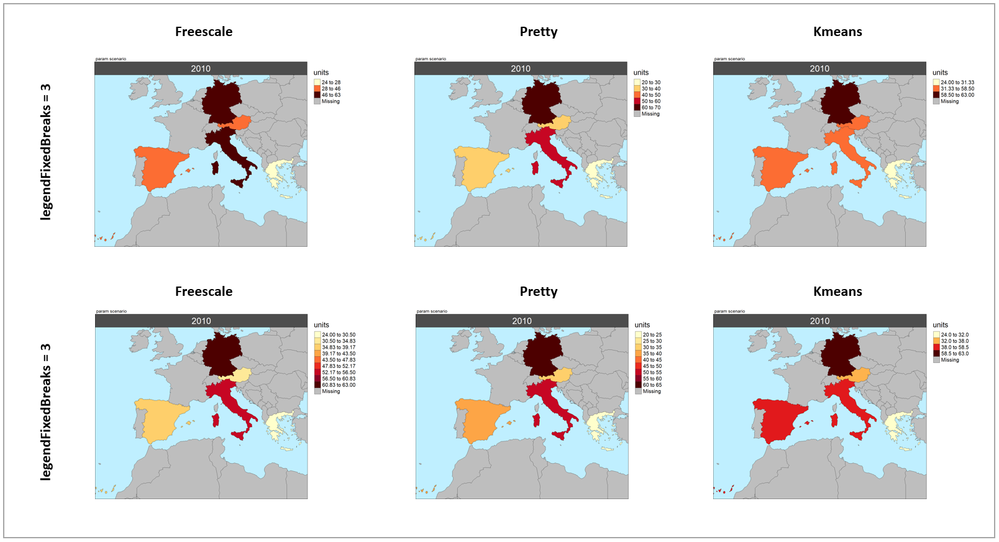</p>


<!-------------------------->
## Legend Type
<!-------------------------->

* There are four types of legend options (`legendType`): "kmeans", "pretty", "freescale" and "fixed".
* The default is "kmeans". Users can set `legendType = "all"` or any combination of `legendType = c("kmeans","pretty","freescale")`
* Fixed legend breaks can be set using ```legendFixedBreaks```.
* If ```legendFixedBreaks``` does not capture the full range of data, the maximum and minimum values will be appended to the data.


```{r, eval=F}
library(rmap)
data = data.frame(subRegion = c("Austria","Spain", "Italy", "Germany","Greece"),
                  year = rep(2010,5),
                  value = c(32, 38, 54, 63, 24))

map(data = data, folder ="legendType",
                  cropToBoundary = T, background = T,
                  legendFixedBreaks=c(20,40,50),
                  nameAppend="_legendFixedBreaks")

map(data = data, folder ="legendType",
                  cropToBoundary = T, background = T,
                  legendType=c("kmeans"),
                  nameAppend="_legendTypeKmeans")

map(data = data, folder ="legendType",
                  cropToBoundary = T, background = T,
                  legendType=c("kmeans","pretty"),
                  nameAppend="_legendTypeKmeansPretty")

```


<p align="center" style="font-size:18px;"> *Legend Customization - Legend Fixed Breaks* </p>
<p align="center"> 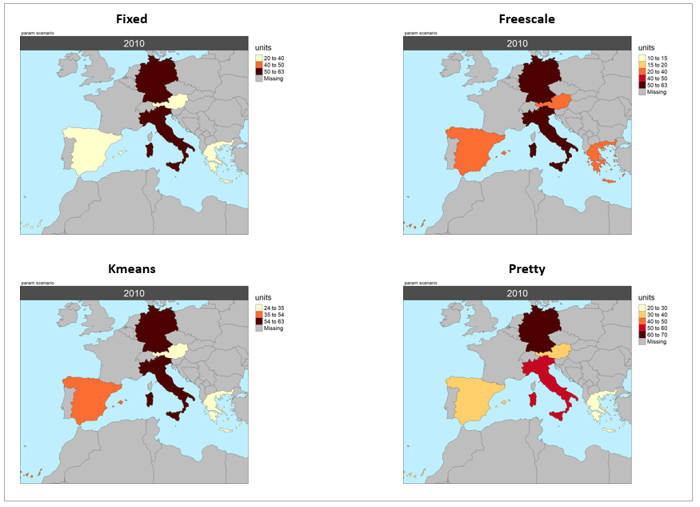</p>


<!-------------------------->
<!-------------------------->
# Numeric2Cat

<!-------------------------->
<!-------------------------->

The `numeric2cat` parameter in the map function allows users to assign their own categorical legend labels for chosen ranges of numeric values.

```{r, eval=F}
library(rmap)
# Create a list of ranges and categorical color scales for each parameter
numeric2Cat_param <- list("param1",
                          "param2")
numeric2Cat_breaks <- list(c(-Inf, 0.1,1.1,2.1,3.1,4.1,5.1,10.1,Inf),
                           c(-Inf, 0.1, 0.2, 0.4,Inf))
numeric2Cat_labels <- list(c("0","1","2","3","4","5","10",">10"),
                           c("None (0<WSI<0.1)","Low (0.1<WSI<0.2)","Moderate (0.2<WSI<0.4)","Severe (WSI>0.4)"))
numeric2Cat_palette <- list(c("0"="green","1"="#fee5d9","2"="#fcbba1",
                              "3"="#fc9272","4"="#fb6a4a","5"="#de2d26",
                              "10"="#a50f15",">10"="black"),
                            c("pal_ScarcityCat")) # Can be a custom scale or an R brewer paletter or an rmap palette
numeric2Cat_legendTextSize <- list(c(0.7),
                                   c(0.7))
numeric2Cat_list <-list(numeric2Cat_param = numeric2Cat_param,
                        numeric2Cat_breaks = numeric2Cat_breaks,
                        numeric2Cat_labels = numeric2Cat_labels,
                        numeric2Cat_palette = numeric2Cat_palette,
                        numeric2Cat_legendTextSize = numeric2Cat_legendTextSize); numeric2Cat_list

data = data.frame(subRegion = c("CA","AZ","TX","NH","ID","OH",
                              "CA","AZ","TX","NH","ID","OH"),
                  x = c(2050,2050,2050,2050,2050,2050,
                      2050,2050,2050,2050,2050,2050),
                  value = c(0,1,3,20,2,1,
                          0,0.1,0.3,0.2,0.25,0.5),
                  param = c(rep("param1",6),rep("param2",6)))
rmap::map(data = data,
                  folder = "numeric2cat",
                  numeric2Cat_list = numeric2Cat_list)
```


<p align="center" style="font-size:18px;"> *numeric2cat* </p>
<p align="center"> 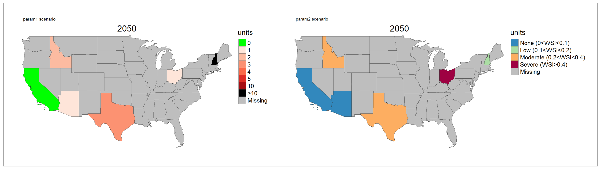</p>


<!-------------------------->
<!-------------------------->
# GCAM Results

<!-------------------------->
<!-------------------------->

In this example data was extracted from the preloaded GCAM output `rmap::exampleGCAMproj` and aggregated by paramater and class into `rmap::exampleMapDataParam` and `rmap::exampleMapDataClass`. Users can process their own GCAM data outputs into similar tables.

**Note: The exampleGCAMproj comes with only a few parameters: "elecByTechTWh","pop","watWithdrawBySec","watSupRunoffBasin","landAlloc" and "agProdByCrop"**


```{r, eval=F}
library(rmap)

dfParam <- rmap::exampleMapDataParam %>%
  dplyr::filter(region %in% c("India","China","Pakistan"),
                param %in% c("landAlloc", "elecByTechTWh","watWithdrawBySec","pop")); dfParam
dfClass <- rmap::exampleMapDataClass%>%
  dplyr::filter(region %in% c("India","China","Pakistan"),
                param %in% c("landAlloc")); dfClass

# Plot data aggregated by param
map(data = dfParam, folder = "GCAMbyParam",
    cropToBoundary = T, background = T, xRange = c(2015,2030,2040,2050),
    scenRef = "SSP3", scaleRange = data.frame(param = c("landAlloc", "elecByTechTWh","watWithdrawBySec","pop"),
                                              min = c(0,0,0,0),
                                              max = c(10000,15000,2000,2000)))

# Plot data aggregated by Class1
map(data = dfClass, folder = "GCAMbyClass",
    cropToBoundary = T, background = T, xRange = c(2015,2030,2040,2050),
    scenRef = "SSP3")

```


<p align="center" style="font-size:18px;"> *GCAM Outputs Folder Structure* </p>
<p align="center"> 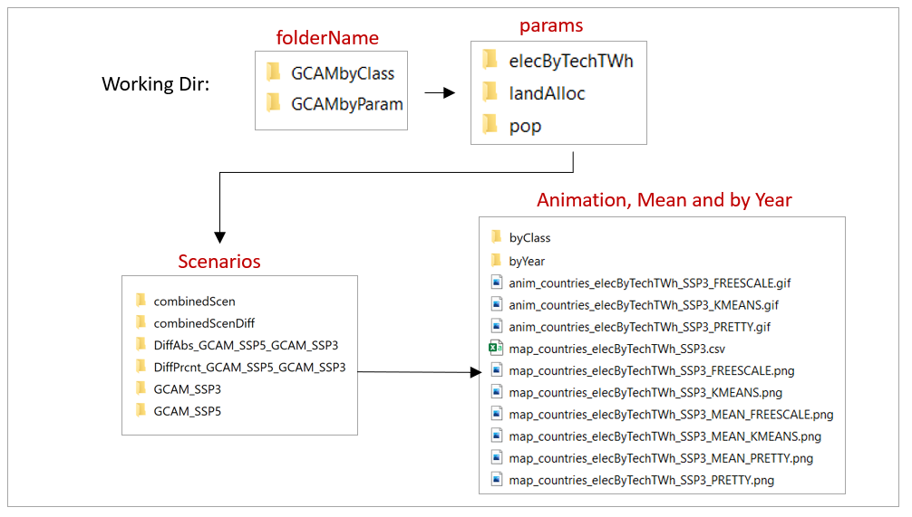</p>


<p align="center" style="font-size:18px;"> *GCAM Maps by Param (Selected)* </p>
<p align="center"> 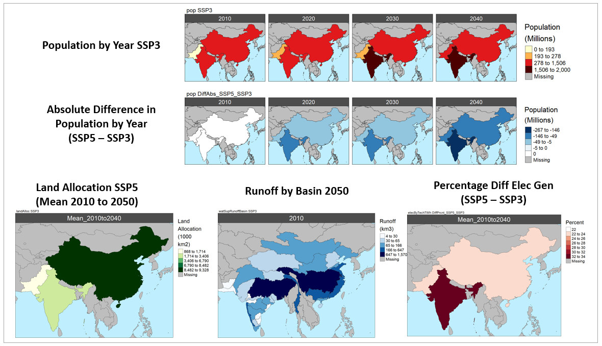</p>

<p align="center" style="font-size:18px;"> *GCAM Maps by Param Animations (Selected)* </p>
Pop |  Electricity (TWh)
:-------------------------:|:-------------------------:
  |    

Land Allocation |  Water Withdrawals
:-------------------------:|:-------------------------:
  |  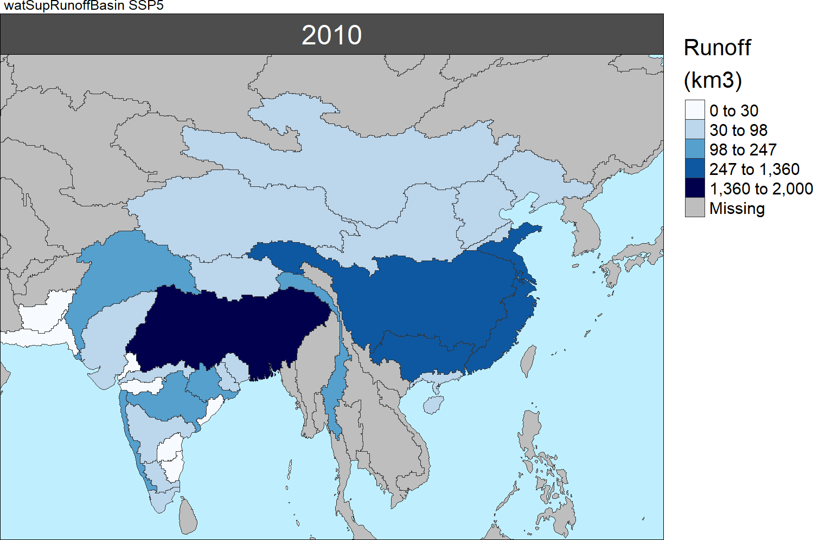  


<p align="center" style="font-size:18px;"> *GCAM Maps by Class (Selected)* </p>
<p align="center"> </p>

<p align="center" style="font-size:18px;"> *GCAM Maps by Class Animations (Selected)* </p>
Electricity (TWh) | Land Allocation
:-------------------------:|:-------------------------:
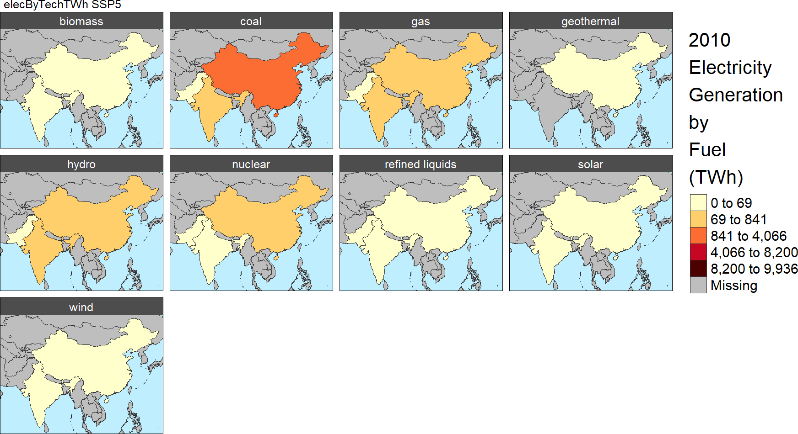  |  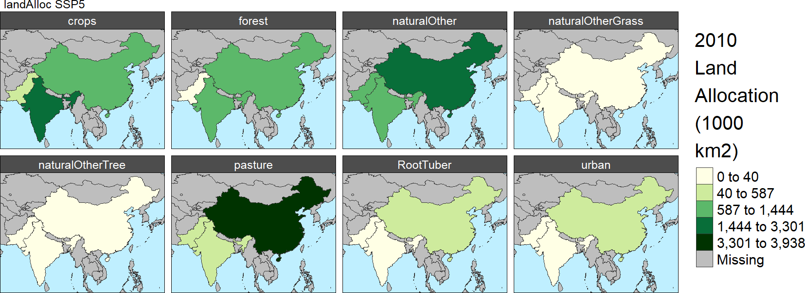  
