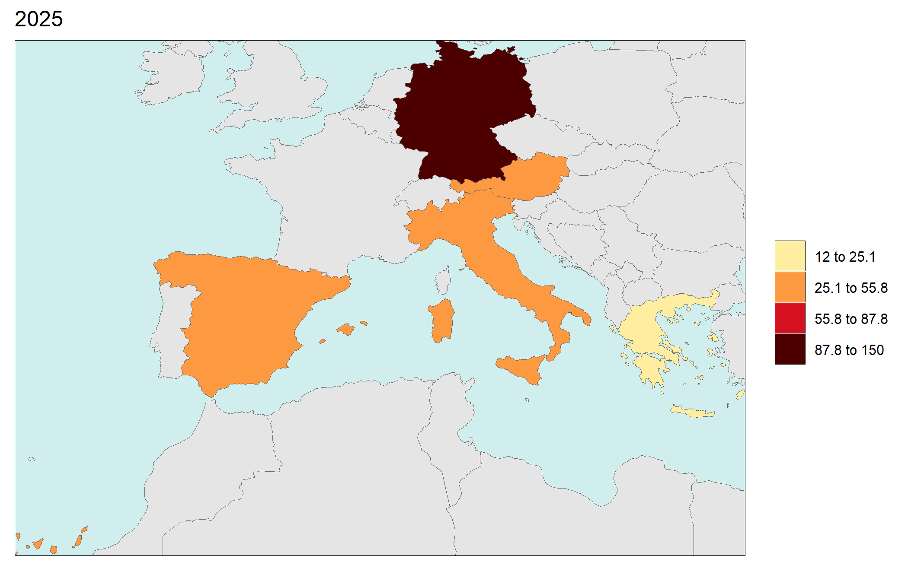
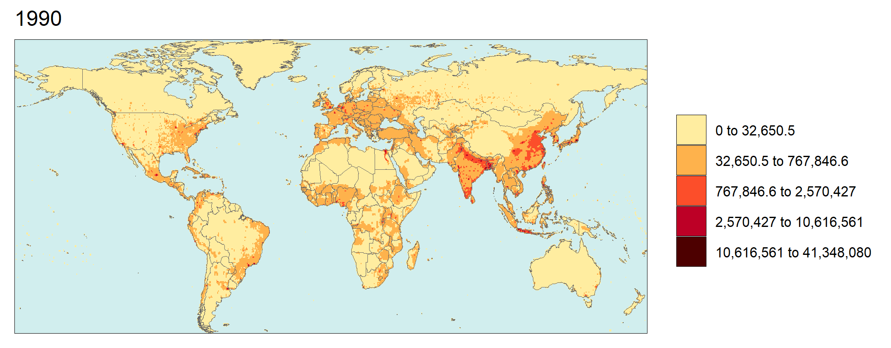

<!-------------------------->
<!-------------------------->
<!-- HTML styles items    -->
<!-------------------------->
<!-------------------------->

<style>
.button {
  background-color: #555555;
  border-radius: 8px;
  border: none;
  color: white;
  padding: 15px 32px;
  text-align: center;
  text-decoration: none;
  display: inline-block;
  font-size: 16px;
  margin: 4px 2px;
  cursor: pointer;
}

.button:hover {
  box-shadow: 0 12px 16px 0 rgba(0,0,0,0.24), 0 17px 50px 0 rgba(0,0,0,0.19);
  background-color: #555555;
  color: gold;
}

</style>

<!-- ------------------------>
<!-- ------------------------>
# Install
<!-- ------------------------>
<!-- ------------------------>
<p align="center"> </p>

1. Download and install:
    - R (https://www.r-project.org/)
    - R studio (https://www.rstudio.com/) (Optional)
    
    
2. In R or R studio:

```r
install.packages("devtools")
devtools::install_github("JGCRI/rmap")
```

Additional steps for UBUNTU from a terminal
```
sudo add-apt-repository ppa:ubuntugis/ppa
sudo apt-get update
sudo apt-get install -y libcurl4-openssl-dev libssl-dev libxml2-dev libudunits2-dev libgdal-dev libgeos-dev libproj-dev libavfilter-dev  libmagick++-dev
```

Additional steps for MACOSX from a terminal
```
brew install pkg-config
brew install gdal
brew install geos
brew install imagemagick@6
```

<!-------------------------->
<!-------------------------->
# Input Formats {#inputs}
<!-------------------------->
<!-------------------------->
<p align="center"> </p>

The main input is the `data` argument in the `map()` function. This will be an R table which can be created within R or read in from a csv file as shown below. As shown later if a shape file (`SpatialPolygonDataFrame`) is provided as the data argument (see Section [Built-in Maps](#maps)) then the `map()` function will produce a map without any value data.

<p align="center"> </p>

Users can also assign other column names to `subRegion` and `value` if desired using the `subRegCol` and `valueCol` arguments as follows:

```{r, results = "hide", eval=FALSE, echo=TRUE, warning=FALSE, error = FALSE, message = FALSE}
library(rmap);
data = data.frame(my_column_1 = c("CA","FL","ID","MO","TX","WY"),
                  my_column_2 = c(5,10,15,34,2,7))
rmap::map(data,
          subRegCol = "my_column_1",
          valueCol = "my_column_2")

```

<!-------------------------->
<!-------------------------->
# Output Formats {#outputs}
<!-------------------------->
<!-------------------------->
<p align="center"> </p>

The output of the `map()` function is a named list with all maps and animations created in the function. The elements of the list can be called individually and re-used as layers in new maps as decribed in the [Layers](#layers) section. Since the output maps are `ggplot` elements all the features of the map can easily be modified using the taditional `ggplot2` theme options. Examples are provided in the [Themes](#themes) section. 

```{r, results = "hide", eval=FALSE, echo=TRUE, warning=FALSE, error = FALSE, message = FALSE}
library(rmap);
my_map_list <- rmap::map(mapUS49) # my_map_list will contain a list of the maps produced. In this case a single map.
my_map <- my_map_list[[1]] # my_map will be the first map in the list of maps produced
my_map_names <- names(my_map_list) # Will give you a list of the maps produced.
rmap::map(mapUS49) # Will print out the maps to the console as well save the maps as well as the related data tables to a default directory.
rmap::map(mapUS49, show = F) # will return a map and save to disk without printing to console.
rmap::map(mapUS49, folder = "myOutputs") # Will save outputs to a directory called myOutputs
rmap::map(mapUS49, save = F) # Will simply print the maps to the console and not save the maps to file.
```

```{r,  results="hide", eval=TRUE, echo=F, warning=FALSE, error = FALSE, message = FALSE}
library(rmap);
rmap::map(mapUS49, save = F)
```

<!-------------------------->
<!-------------------------->
# Built-in Maps {#maps}
<!-------------------------->
<!-------------------------->
<p align="center"> </p>

rmap comes with a set of preloaded maps. A full list of maps is available in the reference list of [maps](https://jgcri.github.io/rmap/reference/index.html). The pre-loaded maps are all `sf` objects. Each map comes with a data column named **subRegion**. For each map the data contained in the shape and the map itself can be viewed as follows:

```{r, results = 'hide', eval=FALSE, echo=TRUE, warning=FALSE, error = FALSE, message = FALSE}
library(rmap);

head(mapUS49) # To view data for chosen map
plot(mapUS49[,"subRegion"]) # plot regular sf object
# Plot Using rmap
rmap::map(mapUS49)
rmap::map(mapUS52)
rmap::map(mapUS52Compact)
rmap::map(mapUS49County)
rmap::map(mapUS52County)
rmap::map(mapUS52CountyCompact)
rmap::map(mapCountries)
rmap::map(mapCountriesUS52)
rmap::map(mapGCAMReg32)
rmap::map(mapGCAMReg32US52)
rmap::map(mapGCAMBasins)
rmap::map(mapGCAMBasinsUS49)
rmap::map(mapGCAMBasinsUS52)
rmap::map(mapGCAMLand) # Intersection of GCAM 32 regions and GCAM Basins
rmap::map(mapStates)
rmap::map(mapHydroShed1)
rmap::map(mapHydroShed2)
rmap::map(mapHydroShed3)
rmap::map(mapIntersectGCAMBasinCountry)
rmap::map(mapIntersectGCAMBasinUS52)
rmap::map(mapIntersectGCAMBasinUS52County)
```


## mapUS49
```{r, results = 'hide', eval=TRUE, echo=FALSE, warning=FALSE, error = FALSE, message = FALSE}
library(rmap);
rmap::map(mapUS49)
```

## mapUS52
```{r, results = 'hide', eval=TRUE, echo=FALSE, warning=FALSE, error = FALSE, message = FALSE}
library(rmap);
rmap::map(mapUS52)
```

## mapUS52Compact
```{r, results = 'hide', eval=TRUE, echo=FALSE, warning=FALSE, error = FALSE, message = FALSE}
library(rmap);
rmap::map(mapUS52Compact)
```

## mapUS49County
```{r, results = 'hide', eval=TRUE, echo=FALSE, warning=FALSE, error = FALSE, message = FALSE}
library(rmap);
rmap::map(mapUS49County)
```

## mapUS52County
```{r, results = 'hide', eval=TRUE, echo=FALSE, warning=FALSE, error = FALSE, message = FALSE}
library(rmap);
rmap::map(mapUS52County)
```

## mapUS52CountyCompact
```{r, results = 'hide', eval=TRUE, echo=FALSE, warning=FALSE, error = FALSE, message = FALSE}
library(rmap);
rmap::map(mapUS52CountyCompact)
```

## mapCountries
```{r, results = 'hide', eval=TRUE, echo=FALSE, warning=FALSE, error = FALSE, message = FALSE}
library(rmap);
rmap::map(mapCountries)
```

## mapCountriesUS52
```{r, results = 'hide', eval=TRUE, echo=FALSE, warning=FALSE, error = FALSE, message = FALSE}
library(rmap);
rmap::map(mapCountriesUS52)
```

## mapGCAMReg32
```{r, results = 'hide', eval=TRUE, echo=FALSE, warning=FALSE, error = FALSE, message = FALSE}
library(rmap);
rmap::map(mapGCAMReg32)
```

## mapGCAMReg32US52
```{r, results = 'hide', eval=TRUE, echo=FALSE, warning=FALSE, error = FALSE, message = FALSE}
library(rmap);
rmap::map(mapGCAMReg32US52)
```

## mapGCAMBasins
```{r, results = 'hide', eval=TRUE, echo=FALSE, warning=FALSE, error = FALSE, message = FALSE}
library(rmap);
rmap::map(mapGCAMBasins)
```

## mapGCAMBasinsUS49
```{r, results = 'hide', eval=TRUE, echo=FALSE, warning=FALSE, error = FALSE, message = FALSE}
library(rmap);
rmap::map(mapGCAMBasinsUS49)
```

## mapGCAMBasinsUS52
```{r, results = 'hide', eval=TRUE, echo=FALSE, warning=FALSE, error = FALSE, message = FALSE}
library(rmap);
rmap::map(mapGCAMBasinsUS52)
```

## mapGCAMLand
```{r, results = 'hide', eval=TRUE, echo=FALSE, warning=FALSE, error = FALSE, message = FALSE}
library(rmap);
rmap::map(mapGCAMLand)
```


## mapStates
```{r, results = 'hide', eval=TRUE, echo=FALSE, warning=FALSE, error = FALSE, message = FALSE}
library(rmap);
rmap::map(mapStates)
```

## mapHydroShed1
```{r, results = 'hide', eval=TRUE, echo=FALSE, warning=FALSE, error = FALSE, message = FALSE}
library(rmap);
rmap::map(mapHydroShed1)
```

## mapHydroShed2
```{r, results = 'hide', eval=TRUE, echo=FALSE, warning=FALSE, error = FALSE, message = FALSE}
library(rmap);
rmap::map(mapHydroShed2)
```

## mapHydroShed3
```{r, results = 'hide', eval=TRUE, echo=FALSE, warning=FALSE, error = FALSE, message = FALSE}
library(rmap);
rmap::map(mapHydroShed3)
```

## mapIntersectGCAMBasinCountry
```{r, results = 'hide', eval=TRUE, echo=FALSE, warning=FALSE, error = FALSE, message = FALSE}
library(rmap);
rmap::map(mapIntersectGCAMBasinCountry)
```

## mapIntersectGCAMBasinUS52
```{r, results = 'hide', eval=TRUE, echo=FALSE, warning=FALSE, error = FALSE, message = FALSE}
library(rmap);
rmap::map(mapIntersectGCAMBasinUS52)
```

## mapIntersectGCAMBasinUS52County
```{r, results = 'hide', eval=TRUE, echo=FALSE, warning=FALSE, error = FALSE, message = FALSE}
library(rmap);
rmap::map(mapIntersectGCAMBasinUS52County)
```

<!-------------------------->
<!-------------------------->
# Projections
<!-------------------------->
<!-------------------------->
<p align="center"> </p>

Users can change the projection of maps using the `crs` argumet as follows:

```{r, results = 'hide', eval=TRUE, echo=T, warning=FALSE, error = FALSE, message = FALSE}
library(rmap);
# ESRI:54032  World Azimuthal Equidistant, https://epsg.io/54032
rmap::map(mapUS49, 
          crs="+proj=aeqd +lat_0=0 +lon_0=0 +x_0=0 +y_0=0 +ellps=WGS84 +datum=WGS84 +units=m no_defs")
 
```

<!-------------------------->
<!-------------------------->
# Map Find
<!-------------------------->
<!-------------------------->
<p align="center"> </p>

Users can have rmap automatically search for an appropriate map using the `map_find` function as follows:

```{r, results = 'hide', eval=TRUE, echo=T, warning=FALSE, error = FALSE, message = FALSE}
library(rmap);
data = data.frame(subRegion = c("CA","FL","ID","MO","TX","WY"),
                  value = c(5,10,15,34,2,7))

map_chosen <- rmap::map_find(data)
map_chosen # Will give a dataframe for the chosen map
rmap::map(map_chosen)
```

<!-------------------------->
<!-------------------------->
# Format & Themes
<!-------------------------->
<!-------------------------->
<p align="center"> </p>


<!-------------------------->
<!-------------------------->
## Layers {#layers}
<!-------------------------->
<!-------------------------->
<p align="center"> </p>

The `map()` funciton in `rmap` works in layers. The central layer is created using the `data` provided which fills out `values` for the `subRegion` or `lat` and `lon` columns provided. In addition to the central layer, users can choose an `underLayer` and an `overLayer` to show different kinds of intersecting boundaries or surrounding regions. The colors, border size and text labels for each layer can be individually be modified or as a global option. Examples of using layers are provided below for a basic dataset. 

```{r, results = 'hide', eval=TRUE, echo=TRUE, warning=FALSE, error = FALSE, message = FALSE}
library(rmap);

# Create data table with a few US states
data = data.frame(subRegion = c("CA","FL","ID","MO","TX","WY"),
                  value = c(5,10,15,34,2,7))

rmap::map(data) # Will choose the contiguous US map and plot this data for you as the only layer

library(rmap);

# Create data table with a few US states
data = data.frame(subRegion = c("CA","FL","ID","MO","TX","WY"),
                  value = c(5,10,15,34,2,7))
rmap::map(data, 
          underLayer=rmap::mapUS49) # Will add an underlayer of the US49 map zoomed in to your data set

library(rmap);

# Create data table with a few US states
data = data.frame(subRegion = c("CA","FL","ID","MO","TX","WY"),
                  value = c(5,10,15,34,2,7))

rmap::map(data, 
          underLayer=rmap::mapUS49, 
          overLayer=rmap::mapGCAMBasinsUS49) # will add GCAM basins ontop of the previous map

```

<!-------------------------->
<!-------------------------->
## Layer Colors {#layercolors}
<!-------------------------->
<!-------------------------->
<p align="center"> </p>

The line width, color and fill of each layer can be individually be modified or as a global option. Examples are provided below for a basic dataset. 

```{r, results = 'hide', eval=TRUE, echo=TRUE, warning=FALSE, error = FALSE, message = FALSE}

# Create a basic map with no data and modify fill as well as line color and lwd.
library(rmap);
# Create data table with a few US states
mapShape = rmap::mapUS49
# Modify the line color and lwd of the base layer
rmap::map(mapShape, 
          fill = "black",
          color = "white",
          lwd = 1.5) # Will adjust the borders of the different layers to highlight them.

# Create a basic map with data and modify line colors and lwd.
library(rmap);
# Create data table with a few US states
data = data.frame(subRegion = c("CA","FL","ID","MO","TX","WY"),
                  value = c(5,10,15,34,2,7))
# Modify the line color and lwd of the base layer
rmap::map(data, 
          color = "blue",
          lwd = 1.5) # Will adjust the borders of the different layers to highlight them.

# Modify under and overlayer fill, line color and lwd.
library(rmap);
# Create data table with a few US states
data = data.frame(subRegion = c("CA","FL","ID","MO","TX","WY"),
                  value = c(5,10,15,34,2,7))

# Modify the fill and outline of the different layers
rmap::map(data, 
          underLayer=rmap::mapUS49, 
          underLayerFill = "black",
          underLayerColor = "green",
          underLayerLwd = 0.5,
          overLayer=rmap::mapGCAMBasinsUS49,
          overLayerColor = "red",
          overLayerLwd = 2) # Will adjust the borders of the different layers to highlight them.
```

<!-------------------------->
<!-------------------------->
## Labels {#labels}
<!-------------------------->
<!-------------------------->
<p align="center"> </p>

Labels can be added to the different layers of the maps as follows:

```{r, results = 'hide', eval=TRUE, echo=TRUE, warning=FALSE, error = FALSE, message = FALSE}
library(rmap);

# Create data table with a few US states
data = data.frame(subRegion = c("CA","FL","ID","MO","TX","WY"),
                  value = c(5,10,15,34,2,7))

# Add Blue Labels
rmap::map(data,
          labels = T,
          labelSize = 10,
          labelColor = "blue")

# Add labels with a transparent background box
rmap::map(data,
          labels = T,
          labelSize = 10,
          labelColor = "black",
          labelFill = "white",
          labelAlpha = 0.8,
          labelBorderSize = 1)

# Repel the labels out with a leader line for crowded labels
rmap::map(data=rmap::mapUS49,
          labels = T,
          labelSize = 6,
          labelColor = "black",
          labelFill = "white",
          labelAlpha = 0.8,
          labelBorderSize = 1,
          labelRepel = 1)


# Choose which layers to apply these label options to.
# Labels for data (labels=T), labels for underlayer (underLayerLabels=T), labels for overLayer (overLayerLabels=T)

# UnderLayer Labels Examples
rmap::map(data,
          underLayer = rmap::mapUS49,
          underLayerLabels = T)

# OverLayer Examples
rmap::map(data,
          underLayer = rmap::mapUS49,
          overLayer = rmap::mapGCAMBasinsUS49,
          overLayerColor = "red",
          overLayerLabels = T,
          labelSize = 3,
          labelColor = "red",
          labelFill = "white",
          labelAlpha = 0.8,
          labelBorderSize = 0.1,
          labelRepel = 0)

# All Labels (Not recommended as too confusing)
rmap::map(data,
          underLayer = rmap::mapUS49,
          overLayer = rmap::mapGCAMBasinsUS49,
          labels = T,
          underLayerLabels = T,
          overLayerLabels = T,          
          labelSize = 2,
          labelColor = "black",
          labelFill = "white",
          labelAlpha = 0.8,
          labelBorderSize = 0.1,
          labelRepel = 1)

```

<!-------------------------->
<!-------------------------->
## Crop {#crop}
<!-------------------------->
<!-------------------------->
<p align="center"> </p>

By default the maps are cropped to the extent of the subRegions provided in the data. If the argument `crop` is set to `FALSE` then the map will zoom to extents of the largest layer in the map as shown below. Maps can also be cropped to the underLayer or overLayer by setting the `crop_to_underLayer` and `crop_to_overLayer` arguments to `TRUE`.

```{r, results = 'hide', eval=T, echo=TRUE, warning=FALSE, error = FALSE, message = FALSE}
library(rmap);

# Create data table with a few US states
data = data.frame(subRegion = c("FL","ID","MO","TX","WY"),
                  value = c(10,15,34,2,7))

# Setting crop to F will zoom out to the extent of the largest layer (In this case the underLayer)
rmap::map(data,
          underLayer = rmap::mapUS49,
          underLayerLabels = T,
          labels = T,
          crop = T,
          title = "crop = T")

rmap::map(data,
          underLayer = rmap::mapUS49,
          underLayerLabels = T,
          labels = T,
          crop = F,
          title = "crop = F")

rmap::map(data,
          underLayer = rmap::mapUS49,
          overLayer = rmap::mapGCAMBasinsUS52,
          crop_to_underLayer = T,
          title = "crop_to_underLayer = T")

rmap::map(data,
          underLayer = rmap::mapUS49,
          overLayer = rmap::mapGCAMBasinsUS52,
          crop_to_overLayer = T,
          title = "crop_to_overLayer = T")

```

<!-------------------------->
<!-------------------------->
## Zoom {#zoom}
<!-------------------------->
<!-------------------------->
<p align="center"> </p>

Users can use `zoom` to zoom out or into a cropped map as desired. Options are available to zoom along x only (`zoomx`), along y only (`zoomy`) or both (`zoom`).

```{r, results = 'hide', eval=FALSE, echo=TRUE, warning=FALSE, error = FALSE, message = FALSE}
library(rmap);

# Create data table with a few US states
data = data.frame(subRegion = c("FL","ID","MO","TX","WY"),
                  value = c(10,15,34,2,7))

# Set different zoom levels
m0 = rmap::map(data,underLayer = rmap::mapUS49,zoom = 0)
m1 = rmap::map(data,underLayer = rmap::mapUS49,zoom = 7)
m2 = rmap::map(data,underLayer = rmap::mapUS49,zoom = -10)
m3 = rmap::map(data,underLayer = rmap::mapUS49,zoomx = 3)
m4 = rmap::map(data,underLayer = rmap::mapUS49,zoomy = 4)

```

```{r, results = 'hide', eval=TRUE, echo=FALSE, warning=FALSE, error = FALSE, message = FALSE}
library(rmap); library(cowplot)

# Create data table with a few US states
data = data.frame(subRegion = c("FL","ID","MO","TX","WY"),
                  value = c(10,15,34,2,7))

# Setting crop to F will zoom out to the extent of the largest layer (In this case the underLayer)
m0 = rmap::map(data,underLayer = rmap::mapUS49,zoom = 0, show=F, save = F)
m1 = rmap::map(data,underLayer = rmap::mapUS49,zoom = 1, show=F, save = F)
m2 = rmap::map(data,underLayer = rmap::mapUS49,zoom = 3, show=F, save = F)
m3 = rmap::map(data,underLayer = rmap::mapUS49,zoom = -1, show=F, save = F)
m4 = rmap::map(data,underLayer = rmap::mapUS49,zoom = -3, show=F, save = F)
m5 = rmap::map(data,underLayer = rmap::mapUS49,zoomx = 3, show=F, save = F)
m6 = rmap::map(data,underLayer = rmap::mapUS49,zoomy = 3, show=F, save = F)

cowplot::plot_grid(m0[[1]],m1[[1]], m2[[1]],m3[[1]], m4[[1]], m5[[1]], m6[[1]],
                   labels = c('zoom = 0',
                              'zoom = 1', 
                              'zoom = 3',
                              'zoom = -1', 
                              'zoom = -3',
                              'zoomx = 3', 
                              'zoomy = 3'), label_size = 14)

```

<!-------------------------->
<!-------------------------->
## Background {#background}
<!-------------------------->
<!-------------------------->
<p align="center"> </p>

While users can adjust all the elements of the map using ggplot themes as explained in the [Themes](#themes) section, we have provided a quick argument to simply add blue for oceans and a border to the map if the `background` argument is set to `T`. Additionally if the `background` argument is set to any color such as `grey10` then the map with border will be produced with that color.

```{r, results = 'hide', eval=T, echo=TRUE, warning=FALSE, error = FALSE, message = FALSE}
library(rmap);

# Create data table with a few US states
data = data.frame(subRegion = c("CA","FL","ID","MO","TX","WY"),
                  value = c(5,10,15,34,2,7))

# Setting background will add blue for water and a border to the map.
rmap::map(data,
          labels = T,
          underLayer = rmap::mapCountriesUS52,
          background = F,
          title = "background = F")
  

rmap::map(data,
          labels = T,
          underLayer = rmap::mapCountriesUS52,
          background = T,
          title = "background = T")


rmap::map(data,
          labels = T,
          underLayer = rmap::mapCountriesUS52,
          background = "grey10",
          title = "background = 'grey10")

```

<!-------------------------->
<!-------------------------->
## Themes {#themes}
<!-------------------------->
<!-------------------------->
<p align="center"> </p>

The outputs of `rmap::map()` is a list with `ggplot2` objects which can be modified using standard ggplot2 [themes](https://ggplot2.tidyverse.org/reference/ggtheme.html) or by adjusting any individual component of [ggplot2 elements](https://ggplot2.tidyverse.org/reference/theme.html). Some examples are shown below.

```{r, results = 'hide', eval=T, echo=TRUE, warning=FALSE, error = FALSE, message = FALSE}
library(rmap); library(ggplot2)

# Create data table with a few US states
data = data.frame(subRegion = c("CA","FL","ID","MO","TX","WY"),
                  value = c(5,10,15,34,2,7))

# Setting m1 to the first element of the map outputs from rmap::map() with save = F to avoid printing
m1 <- rmap::map(data,
          labels = T,
          underLayer = rmap::mapCountriesUS52,
          background = T,
          show = F)

# Now Print with different ggplot elements
m1[[1]] + ggplot2::ggtitle("No Theme")

# Apply the ggplot theme_dark()
m1[[1]] + 
  ggplot2::theme_dark() +
  ggplot2::ggtitle("Theme Dark") +
  ggplot2::xlab("MY X Label") +
  ggplot2::ylab("MY Y Label")

# Apply custom ggplot theme to an element
m1[[1]] +
  ggplot2::ggtitle("Themes: x label and legend position") +
  ggplot2::xlab("x label") +
  ggplot2::theme(legend.position = "bottom",
                 legend.text = element_text(size=20),
                 axis.title.x = element_text(size=20))

```

<!-------------------------->
<!-------------------------->
# Plot Polygon Data
<!-------------------------->
<!-------------------------->
<p align="center"> </p>

For a given data table in the correct format (see [Input Format](#inputs)) `map()` will search through the list of [maps](https://jgcri.github.io/rmap/reference/index.html) to see if it can find the "subRegions" provided in the data and then plot the data on the most appropriate map. Users can specify a specific map. Some examples are provided below:

```{r, results = 'hide', eval=TRUE, echo=TRUE, warning=FALSE, error = FALSE, message = FALSE}
library(rmap);

# US Contiguous States 
data = data.frame(subRegion = c("CA","FL","ID","MO","TX","WY"),
                  value = c(5,10,15,34,2,7))
map(data)

```


<!-------------------------->
<!-------------------------->
# Polygon Data Select Map {#select}
<!-------------------------->
<!-------------------------->
<p align="center"> </p>

Sometimes subRegions can be present on multiple maps. For example "Colombia", China" and "India" are all members of `rmap::mapGCAMReg32` as well as `rmap::mapCountries`. If a user knows which map they want to plot their data on they should specify the map in the `shape` argument.


```{r, results = 'hide', eval=TRUE, echo=TRUE, warning=FALSE, error = FALSE, message = FALSE}
library(rmap)

data = data.frame(subRegion = c("China","India","Pakistan"),
                  x = c(2050,2050,2050),
                  value = c(5,12,30))

# Auto selection by rmap will choose rmap::mapCountries
rmap::map(data)

# User can specify that they want to plot this data on rmap::mapGCAMReg32
rmap::map(data,
          shape = rmap::mapGCAMReg32)

```

<!-------------------------->
<!-------------------------->
# Plot Gridded Data
<!-------------------------->
<!-------------------------->
<p align="center"> </p>

For a given data table in the correct format (see [Input Format](#inputs)) `map()` will search through the list of [maps](https://jgcri.github.io/rmap/reference/index.html) to see if it can find the "subRegions" provided in the data and then plot the data on the most appropriate map. Users can specify a specific map. Some examples are provided below:


```{r, eval=TRUE, echo=TRUE, warning=FALSE, error = FALSE, message = FALSE}
library(rmap); library(dplyr)

# Using example grid data provided in rmap
# example_gridData_GWPv4To2015
# Original data from https://sedac.ciesin.columbia.edu/data/set/gpw-v4-population-count-rev11/data-download#
# Center for International Earth Science Information Network (CIESIN) - Columbia University. 2016.
# Gridded Population of the World, Version 4 (GPWv4): Population Count. NASA Socioeconomic Data and Applications Center (SEDAC),
# Palisades, NY. DOI: http://dx.doi.org/10.7927/H4X63JVC

# Subset data
data = example_gridData_GWPv4To2015 %>% 
  filter(x == 2015);
head(data)
```

```{r, results = 'hide', eval=TRUE, echo=TRUE, warning=FALSE, error = FALSE, message = FALSE}
rmap::map(data)

# Plot part of data (first 10000 rows)
rmap::map(data %>% head(10000))

# Add an underlayer to gridded data
rmap::map(data,
          overLayer = rmap::mapCountriesUS52,
          background=T)

```

<!-------------------------->
<!-------------------------->
# Create Custom Map Shape
<!-------------------------->
<!-------------------------->
<p align="center"> </p>

Users can provide custom shapefiles for their own data if needed. The example below shows how to create a custom shapefile and then plot data on it. 

## Subset existing shape

```{r, results = 'hide', eval=TRUE, echo=TRUE, warning=FALSE, error = FALSE, message = FALSE}
library(rmap)

shapeSubset <- rmap::mapStates # Read in World States shape file
shapeSubset <- shapeSubset[shapeSubset$region %in% c("Colombia"),] # Subset the shapefile to Colombia
rmap::map(shapeSubset) # View custom shape
head(shapeSubset) # review data
unique(shapeSubset$subRegion) # Get a list of the unique subRegions

# Plot data on subset
data = data.frame(subRegion = c("Cauca","Valle del Cauca","Antioquia","Córdoba","Bolívar","Atlántico"),
                  x = c(2050,2050,2050,2050,2050,2050),
                  value = c(5,10,15,34,2,7))

rmap::map(data,
          shape = shapeSubset,
          underLayer = shapeSubset,
          crop=F) # Must rename the states column to 'subRegion'

```

## Crop a shape to another shape

For example if someone wants to analyze counties in Texas.

```{r, results = 'hide', eval=F, echo=TRUE, warning=FALSE, error = FALSE, message = FALSE}
library(rmap); library(raster); library(sf)

shapeSubRegions <- rmap::mapUS49County
shapeCropTo <- rmap::mapUS49
shapeCropTo <- shapeCropTo[shapeCropTo$subRegion %in% c("TX"),]
shapeCrop<- sf::st_transform(shapeCropTo,sf::st_crs(shapeSubRegions))
shapeCrop <-sf::st_as_sf(raster::crop(as(shapeSubRegions,"Spatial"),as(shapeCropTo,"Spatial")))
rmap::map(shapeCrop)

# Plot data on subset
data = data.frame(subRegion = c("Wise_TX","Scurry_TX","Kendall_TX","Frio_TX","Hunt_TX","Austin_TX"),
                  value = c(5,10,15,34,2,7))
rmap::map(data,
          shape = shapeCrop,
          underLayer = shapeCrop,
          crop=F)

```

## Save Custom Shapefile {#saveShape}

A cropped or custom shapefile which may be much smaller in size can be saved offline as an `ESRI Shapefile` for later use in `rmap` or other software if desired as follows: 

```{r, results = 'hide', eval=F, echo=TRUE, warning=FALSE, error = FALSE, message = FALSE}
library(rgdal)

rgdal::writeOGR(obj=shapeCrop,
                dsn=paste0("path/to/shapefile/shapeCrop"),
                layer="shapeCrop",
                driver="ESRI Shapefile", overwrite_layer=TRUE)

```

## Read data from a Shapefile

User can read data from their own offline `ESRI Shapefile`. Usually the shapefile is contained in a single folder (e.g. `custom_shape_folder`) with the following subfiles, where `custom_shape` will be a different name. These kinds of files can be created in R, ArcGIS, QGIS and other softwares (see Section [Save Custom Shapefile](#saveShape)).

- custom_shape.dbf
- custom_shape.prj
- custom_shape.shp
- custom_shape.shx
 
After reading in the shapefile (e.g. as `my_custom_map`), users will need to insure that it contains a `subRegion` column corresponding to the features in the shape.
 
```{r, results = 'hide', eval=F, echo=TRUE, warning=FALSE, error = FALSE, message = FALSE}
library(rmap); library(rgdal); library(sp)

# Assuming custom_shape files are in folder custom_shape_folder
my_custom_map = sf::st_read("path/to/custom_shape_file.shp")
head(my_custom_map)
plot(my_custom_map) # Quick view of shape
# Rename subRegion column
my_custom_map <- my_custom_map %>% dplyr::mutate(subRegion="CHOOSE_APPROPRIATE _COLUMN");

# Now a data frame with data corresponding to the custom shape regions can be created and plotted
# Generate some random data for each subRegion
data <- data.frame(subRegion=unique(my_custom_map$subRegion),
                   value = 100*runif(length(unique(my_custom_map$subRegion))));
head(data)
# And then it can be plotted using rmap and any of the built-in maps as underLayers.
rmap::map(data,
          shape=my_custom_map,
          underLayer=rmap::mapCountries,
          underLayerLabels = T)
```

<!-------------------------->
<!-------------------------->
# Multi-Year-Class-Scenario-Facet

<!-------------------------->
<!-------------------------->


<!-------------------------->
## Multi-Year & Animations

<!-------------------------->

<p align="center"> </p>

### Polygon Data Multi-Year

```{r, results = 'hide', eval=F, echo=TRUE, warning=FALSE, error = FALSE, message = FALSE}
library(rmap);

data = data.frame(subRegion = c("Austria","Spain", "Italy", "Germany","Greece",
                                "Austria","Spain", "Italy", "Germany","Greece",
                                "Austria","Spain", "Italy", "Germany","Greece",
                                "Austria","Spain", "Italy", "Germany","Greece"),
                  year = c(rep(2025,5),
                               rep(2050,5),
                               rep(2075,5),
                               rep(2100,5)),
                  value = c(32, 38, 54, 63, 24,
                            37, 53, 23, 12, 45,
                            23, 99, 102, 85, 75,
                            12, 76, 150, 64, 90))

rmap::map(data = data,
          underLayer = rmap::mapCountries,
          ncol=4,
          background = T)

# NOTE: Animation files are only saved to file and not as a direct output of the rmap::map() function.

```

```{r, results = 'hide', eval=T, echo=F, warning=FALSE, error = FALSE, message = FALSE}
library(rmap);

data = data.frame(subRegion = c("Austria","Spain", "Italy", "Germany","Greece",
                                "Austria","Spain", "Italy", "Germany","Greece",
                                "Austria","Spain", "Italy", "Germany","Greece",
                                "Austria","Spain", "Italy", "Germany","Greece"),
                  year = c(rep(2025,5),
                               rep(2050,5),
                               rep(2075,5),
                               rep(2100,5)),
                  value = c(32, 38, 54, 63, 24,
                            37, 53, 23, 12, 45,
                            23, 99, 102, 85, 75,
                            12, 76, 150, 64, 90))

mapx <- rmap::map(data = data,
          underLayer = rmap::mapCountries,
          background = T,
          ncol = 4,
          show=F, save = T)

mapx$map_param_KMEANS
mapx$map_param_MEAN_KMEANS

```

<p align="center"> </p>


### Gridded Data Multi-Year

```{r, results = 'hide', eval=F, echo=TRUE, warning=FALSE, error = FALSE, message = FALSE}
library(rmap);
data = example_gridData_GWPv4To2015;
head(data)
```

```{r, eval=T, echo=F, warning=FALSE, error = FALSE, message = FALSE}
library(rmap);

data = example_gridData_GWPv4To2015;
head(data)
```

```{r, results = 'hide', eval=F, echo=TRUE, warning=FALSE, error = FALSE, message = FALSE}
library(rmap);
rmap::map(data = data,
          overLayer = rmap::mapCountries,
          background = T)

# NOTE: Animation files are only saved to file and not as a direct output of the rmap::map() function.

```

```{r, results = 'hide', eval=T, echo=F, warning=FALSE, error = FALSE, message = FALSE}
library(rmap);
data = example_gridData_GWPv4To2015;
mapx <- rmap::map(data = data,
          overLayer = rmap::mapCountries,
          background = T,
          show=F, save = T)

mapx$map_param_KMEANS
mapx$map_param_MEAN_KMEANS
```

<!-- <p align="center"> </p> -->


<!-------------------------->
## Multi-Year Diff plots
<!-------------------------->

<p align="center"> </p>

When multiple years are present in the data, assigning an `xRef` and `xDiff` will result in `rmap::map()` to calculate the absolute and percentage difference between the chosen `xref` year and `xDiff` years and store them in corresponding folders.

### Polygon Data Multi-Year Diff

```{r, results = 'hide', eval=F, echo=TRUE, warning=FALSE, error = FALSE, message = FALSE}
library(rmap);

data = data.frame(subRegion = c("Austria","Spain", "Italy", "Germany","Greece",
                                "Austria","Spain", "Italy", "Germany","Greece",
                                "Austria","Spain", "Italy", "Germany","Greece"),
                  year = c(rep(2010,5),rep(2020,5),rep(2030,5)),
                  value = c(32, 38, 54, 63, 24,
                            37, 53, 23, 12, 45,
                            40, 45, 12, 50, 63))

mapx <- rmap::map(data = data,
          background = T, 
          underLayer = rmap::mapCountries,
          xRef = 2010, 
          xDiff = c(2020,2030))

mapx$map_param_KMEANS_xDiffAbs
mapx$map_param_KMEANS_xDiffPrcnt

```

```{r, results = 'hide', eval=T, echo=F, warning=FALSE, error = FALSE, message = FALSE}
library(rmap);

data = data.frame(subRegion = c("Austria","Spain", "Italy", "Germany","Greece",
                                "Austria","Spain", "Italy", "Germany","Greece",
                                "Austria","Spain", "Italy", "Germany","Greece"),
                  year = c(rep(2010,5),rep(2020,5),rep(2030,5)),
                  value = c(32, 38, 54, 63, 24,
                            37, 53, 23, 12, 45,
                            40, 45, 12, 50, 63))

mapx <- rmap::map(data = data,
          background = T, 
          underLayer = rmap::mapCountries,
          xRef = 2010, 
          xDiff = c(2020,2030),
          show = F)

mapx$map_param_KMEANS_xDiffAbs
mapx$map_param_KMEANS_xDiffPrcnt

```


### Gridded Data Multi-Year Diff

```{r, results = 'hide', eval=F, echo=TRUE, warning=FALSE, error = FALSE, message = FALSE}
library(rmap);

data = example_gridData_GWPv4To2015
mapx <- rmap::map(data = data,
          background = T, 
          underLayer = rmap::mapCountries,
          xRef = 2000, 
          xDiff = c(2010,2015), diffOnly = T)

mapx$map_param_KMEANS_xDiffAbs
mapx$map_param_KMEANS_xDiffPrcnt
```

```{r, results = 'hide', eval=T, echo=F, warning=FALSE, error = FALSE, message = FALSE}
library(rmap);

data = example_gridData_GWPv4To2015
mapx <- rmap::map(data = data,
          background = T, 
          underLayer = rmap::mapCountries,
          xRef = 2000, 
          xDiff = c(2010,2015),
          show=F, save = T)

mapx$map_param_KMEANS_xDiffAbs
mapx$map_param_KMEANS_xDiffPrcnt

```


<!-------------------------->
## Multi-Class
<!-------------------------->
<p align="center"> </p>

### Polygon Data Multi-Class

```{r, results = 'hide', eval=T, echo=TRUE, warning=FALSE, error = FALSE, message = FALSE}
library(rmap);

data = data.frame(subRegion = c("Austria","Spain", "Italy", "Germany","Greece",
                                "Austria","Spain", "Italy", "Germany","Greece",
                                "Austria","Spain", "Italy", "Germany","Greece",
                                "Austria","Spain", "Italy", "Germany","Greece"),
                  class = c(rep("municipal",5),
                               rep("industry",5),
                               rep("agriculture",5),
                               rep("transport",5)),
                  value = c(32, 38, 54, 63, 24,
                            37, 53, 23, 12, 45,
                            23, 99, 102, 85, 75,
                            12, 76, 150, 64, 90))
rmap::map(data = data,
          underLayer = rmap::mapCountries,
          background = T )
```

### Gridded Data Multi-Class

```{r, results = 'hide', eval=T, echo=TRUE, warning=FALSE, error = FALSE, message = FALSE}
library(rmap);library(dplyr)

# Change the years in the gridded data to classes
data = example_gridData_GWPv4To2015 %>%
  dplyr::rename(class=x) %>%
  dplyr::mutate(class = dplyr::case_when(
    class == "2000" ~ "municipal",
    class == "2005" ~ "agriculture",
    class == "2010" ~ "water",
    class == "2015" ~ "other",
    TRUE ~ class
  ))

rmap::map(data = data,
          overLayer = rmap::mapCountries,
          background = T,
          ncol = 2, width = 10, height = 10)
```


<!-------------------------->
## Multi-Scenario
<!-------------------------->
<p align="center"> </p>

With multiple scenarios present an additional folder and maps for combined scenarios are produced.

### Polygon Data Multi-Scenario

```{r, results = 'hide', eval=F, echo=TRUE, warning=FALSE, error = FALSE, message = FALSE}
library(rmap);

data = data.frame(subRegion = c("Austria","Spain", "Italy", "Germany","Greece",
                                "Austria","Spain", "Italy", "Germany","Greece",
                                "Austria","Spain", "Italy", "Germany","Greece"),
                  scenario = c("scen1","scen1","scen1","scen1","scen1",
                               "scen2","scen2","scen2","scen2","scen2",
                               "scen3","scen3","scen3","scen3","scen3"),
                  year = rep(2010,15),
                  value = c(32, 38, 54, 63, 24,
                            37, 53, 23, 12, 45,
                            40, 44, 12, 30, 99))

mapx <- rmap::map(data = data, 
          underLayer = rmap::mapCountries,
          background = T)

mapx$map_param_KMEANS

```

```{r, results = 'hide', eval=T, echo=F, warning=FALSE, error = FALSE, message = FALSE}
library(rmap);

data = data.frame(subRegion = c("Austria","Spain", "Italy", "Germany","Greece",
                                "Austria","Spain", "Italy", "Germany","Greece",
                                "Austria","Spain", "Italy", "Germany","Greece"),
                  scenario = c("scen1","scen1","scen1","scen1","scen1",
                               "scen2","scen2","scen2","scen2","scen2",
                               "scen3","scen3","scen3","scen3","scen3"),
                  year = rep(2010,15),
                  value = c(32, 38, 54, 63, 24,
                            37, 53, 23, 12, 45,
                            40, 44, 12, 30, 99))
mapx <- rmap::map(data = data, 
          underLayer = rmap::mapCountries,
          background = T,
          show = F)

mapx$map_param_KMEANS

```


### Customize Order of Scenarios

```{r, results = 'hide', eval=F, echo=TRUE, warning=FALSE, error = FALSE, message = FALSE}
library(rmap);

data = data.frame(subRegion = c("Austria","Spain", "Italy", "Germany","Greece",
                                "Austria","Spain", "Italy", "Germany","Greece",
                                "Austria","Spain", "Italy", "Germany","Greece"),
                  scenario = c("scen1","scen1","scen1","scen1","scen1",
                               "scen2","scen2","scen2","scen2","scen2",
                               "scen3","scen3","scen3","scen3","scen3"),
                  year = rep(2010,15),
                  value = c(32, 38, 54, 63, 24,
                            37, 53, 23, 12, 45,
                            40, 44, 12, 30, 99))

# Reorder your scenarios
data = data %>% 
  dplyr::mutate(scenario = factor(scenario, levels = c("scen1","scen3","scen2")))

mapx <- rmap::map(data = data, 
          underLayer = rmap::mapCountries,
          background = T)

mapx$map_param_KMEANS

```

```{r, results = 'hide', eval=T, echo=F, warning=FALSE, error = FALSE, message = FALSE}
library(rmap);

data = data.frame(subRegion = c("Austria","Spain", "Italy", "Germany","Greece",
                                "Austria","Spain", "Italy", "Germany","Greece",
                                "Austria","Spain", "Italy", "Germany","Greece"),
                  scenario = c("scen1","scen1","scen1","scen1","scen1",
                               "scen2","scen2","scen2","scen2","scen2",
                               "scen3","scen3","scen3","scen3","scen3"),
                  year = rep(2010,15),
                  value = c(32, 38, 54, 63, 24,
                            37, 53, 23, 12, 45,
                            40, 44, 12, 30, 99))

# Reorder your scenarios
data = data %>% 
  dplyr::mutate(scenario = factor(scenario, levels = c("scen1","scen3","scen2")))

mapx <- rmap::map(data = data, 
          underLayer = rmap::mapCountries,
          background = T,
          show = F)

mapx$map_param_KMEANS

```


### Gridded Data Multi-Scenario

```{r, results = 'hide', eval=F, echo=TRUE, warning=FALSE, error = FALSE, message = FALSE}
library(rmap);

# Change the years in the example gridded data to scenarios
data = example_gridData_GWPv4To2015 %>%
  dplyr::filter(x %in% c("2000","2005","2010")) %>%
  dplyr::rename(scenario=x) %>%
  dplyr::mutate(scenario = dplyr::case_when(
    scenario == "2000" ~ "scenario1",
    scenario == "2005" ~ "scenario2",
    scenario == "2010" ~ "scenario3",
    TRUE ~ scenario))
  
mapx <- rmap::map(data = data, 
          underLayer = rmap::mapCountries,
          background = T,
          ncol = 1, width = 6, height =10)

mapx$map_param_KMEANS

```

```{r, results = 'hide', eval=T, echo=F, warning=FALSE, error = FALSE, message = FALSE}
library(rmap);

data = example_gridData_GWPv4To2015 %>%
  dplyr::filter(x %in% c("2000","2005","2010")) %>%
  dplyr::rename(scenario=x) %>%
  dplyr::mutate(scenario = dplyr::case_when(
    scenario == "2000" ~ "scenario1",
    scenario == "2005" ~ "scenario2",
    scenario == "2010" ~ "scenario3",
    TRUE ~ scenario))
  
mapx <- rmap::map(data = data, 
          underLayer = rmap::mapCountries,
          background = T,
          show = F)

mapx$map_param_KMEANS

```

<!-------------------------->
## Multi-Scenario Diff Plots
<!-------------------------->
<p align="center"> </p>

With multiple scenarios present if `scenRef` and `scenDiff` are chosen `rmap::map()` will produce corresponding absolute and difference maps as shown below.

### Polygon Data Multi-Scenario Diff

```{r, results = 'hide', eval=F, echo=TRUE, warning=FALSE, error = FALSE, message = FALSE}
library(rmap);

data = data.frame(subRegion = c("Austria","Spain", "Italy", "Germany","Greece",
                                "Austria","Spain", "Italy", "Germany","Greece",
                                "Austria","Spain", "Italy", "Germany","Greece"),
                  scenario = c("scen1","scen1","scen1","scen1","scen1",
                               "scen2","scen2","scen2","scen2","scen2",
                               "scen3","scen3","scen3","scen3","scen3"),
                  value = c(32, 38, 54, 63, 24,
                            37, 53, 23, 12, 45,
                            40, 44, 12, 30, 99))
mapx <- rmap::map(data = data, 
          underLayer = rmap::mapCountries,
          scenRef = "scen1",
          scenDiff = c("scen2","scen3"), # Can omit this to get difference against all scenarios
          background = T)

mapx$map_param_KMEANS_DiffAbs
mapx$map_param_KMEANS_DiffPrcnt

```

```{r, results = 'hide', eval=T, echo=F, warning=FALSE, error = FALSE, message = FALSE}
library(rmap);

data = data.frame(subRegion = c("Austria","Spain", "Italy", "Germany","Greece",
                                "Austria","Spain", "Italy", "Germany","Greece",
                                "Austria","Spain", "Italy", "Germany","Greece"),
                  scenario = c("scen1","scen1","scen1","scen1","scen1",
                               "scen2","scen2","scen2","scen2","scen2",
                               "scen3","scen3","scen3","scen3","scen3"),
                  value = c(32, 38, 54, 63, 24,
                            37, 53, 23, 12, 45,
                            40, 44, 12, 30, 99))
mapx <- rmap::map(data = data, 
          underLayer = rmap::mapCountries,
          scenRef = "scen1",
          scenDiff = c("scen2","scen3"),
          background = T,
          show = F, save=F)

mapx$map_param_KMEANS_DiffAbs
mapx$map_param_KMEANS_DiffPrcnt

```

### Gridded Data Multi-Scenario Diff

```{r, results = 'hide', eval=F, echo=TRUE, warning=FALSE, error = FALSE, message = FALSE}
library(rmap); library(dplyr)

# Change the years in the example gridded data to scenarios
data = example_gridData_GWPv4To2015 %>%
  dplyr::filter(x %in% c("2000","2005","2010")) %>%
  dplyr::rename(scenario=x) %>%
  dplyr::mutate(scenario = dplyr::case_when(
    scenario == "2000" ~ "scenario1",
    scenario == "2005" ~ "scenario2",
    scenario == "2010" ~ "scenario3",
    TRUE ~ scenario))
  
mapx <- rmap::map(data = data, 
          underLayer = rmap::mapCountries,
          scenRef = "scenario1",
          scenDiff = c("scenario2","scenario3"),
          background = T,
          ncol=1)

mapx$map_param_KMEANS_DiffAbs
mapx$map_param_KMEANS_DiffPrcnt

```

```{r, results = 'hide', eval=F, echo=F, warning=FALSE, error = FALSE, message = FALSE}
library(rmap);

# # Change the years in the example gridded data to scenarios
data = example_gridData_GWPv4To2015 %>%
  dplyr::filter(x %in% c("2000","2005","2010")) %>%
  dplyr::rename(scenario=x) %>%
  dplyr::mutate(scenario = dplyr::case_when(
    scenario == "2000" ~ "scenario1",
    scenario == "2005" ~ "scenario2",
    scenario == "2010" ~ "scenario3",
    TRUE ~ scenario))

mapx <- rmap::map(data = data,
          underLayer = rmap::mapCountries,
          scenRef = "scenario1",
          scenDiff = c("scenario2","scenario3"),
          background = T,
          save=F, show=F,
          ncol=1)

mapx$map_param_KMEANS_DiffAbs
mapx$map_param_KMEANS_DiffPrcnt

```


<!-------------------------->
## Multi-Facet Maps
<!-------------------------->
<p align="center"> </p>

If the data set has additional rows and columns by which the user wants to plot their maps they can set these in the `row` and `col` arguments.

### Polygon Data Multi-Facet

```{r, results = 'hide', eval=T, echo=TRUE, warning=FALSE, error = FALSE, message = FALSE}
library(rmap);

data = data.frame(subRegion = c("Austria","Spain", "Italy", "Germany","Greece",
                                "Austria","Spain", "Italy", "Germany","Greece",
                                "Austria","Spain", "Italy", "Germany","Greece",
                                "Austria","Spain", "Italy", "Germany","Greece"),
                  rcp = c(rep("RCP1",5),
                          rep("RCP2",5),
                          rep("RCP1",5),
                          rep("RCP2",5)),
                  gcm = c(rep("GCM1",5),
                          rep("GCM1",5),
                          rep("GCM2",5),
                          rep("GCM2",5)),
                  value = c(32, 38, 54, 63, 24,
                            37, 53, 23, 12, 45,
                            23, 99, 102, 85, 75,
                            12, 76, 150, 64, 90))
rmap::map(data = data,
          underLayer = rmap::mapCountries,
          row = "rcp",
          col = "gcm",
          background = T )
```

### Gridded Data Multi-Facet

```{r, results = 'hide', eval=T, echo=TRUE, warning=FALSE, error = FALSE, message = FALSE}
library(rmap);library(dplyr)

# Create data with new columns RCPs and GCMs
data = example_gridData_GWPv4To2015 %>%
  dplyr::filter(x %in% c(2000,2005,2010,2015)) %>%
  dplyr::rename(rcp = x) %>%
  dplyr::mutate(gcm = dplyr::case_when(rcp == 2000 ~ "GCM1",
                                       rcp == 2005 ~ "GCM1",
                                       rcp == 2010 ~ "GCM2",
                                       rcp == 2015 ~ "GCM2",
                                       TRUE ~ "GCM"),
                rcp = dplyr::case_when(rcp == 2000 ~ "RCP1",
                                       rcp == 2005 ~ "RCP2",
                                       rcp == 2010 ~ "RCP1",
                                       rcp == 2015 ~ "RCP2",
                                       TRUE ~ rcp)) 
rmap::map(data = data,
          overLayer = rmap::mapCountries,
          row= "rcp",
          col = "gcm",
          background = T,
          width=10, height =10)
```


<!-------------------------->
<!-------------------------->
# Scale Range
<!-------------------------->
<!-------------------------->
<p align="center"> </p>

```{r, results = 'hide', eval=F, echo=TRUE, warning=FALSE, error = FALSE, message = FALSE}
library(rmap)

# For Scenario Diff plots
data = data.frame(subRegion = c("Austria","Spain", "Italy", "Germany","Greece",
                                "Austria","Spain", "Italy", "Germany","Greece"),
                  scenario = c("scen1","scen1","scen1","scen1","scen1",
                               "scen2","scen2","scen2","scen2","scen2"),
                  value = c(32, 38, 54, 63, 24,
                            37, 53, 23, 12, 45))
rmap::map(data = data, 
          background = T, 
          underLayer = rmap::mapCountries,
          scenRef = "scen1",
          scaleRange = c(30,40), 
          scaleRangeDiffAbs = c(-100,100), 
          scaleRangeDiffPrcnt = c(-60,60))

# For Year Diff plots
data = data.frame(subRegion = c("Austria","Spain", "Italy", "Germany","Greece",
                                "Austria","Spain", "Italy", "Germany","Greece"),
                  x = c(rep(2010,5),
                        rep(2020,5)),
                  value = c(32, 38, 54, 63, 24,
                            37, 53, 23, 12, 45))
rmap::map(data = data, 
          background = T, 
          underLayer = rmap::mapCountries,
          xRef = 2010,
          forceFacets = T,
          scaleRange = c(20,30), 
          scaleRangexDiffAbs = c(-70,70), 
          scaleRangexDiffPrcnt = c(-150,150))

# If multiple parameters in data users can set up scaleRange for each param as:
# scaleRange_i = data.frame(param = c("param1","param2"),
#                                   min = c(0,0),
#                                   max = c(15000,2000))
# scaleRangexDiffAbs_i = data.frame(param = c("param1","param2"),
#                                   min = c(0,0),
#                                   max = c(15000,2000))

```


```{r, results = 'hide', eval=T, echo=F, warning=FALSE, error = FALSE, message = FALSE}
library(rmap)

# For Scenario Diff plots
data = data.frame(subRegion = c("Austria","Spain", "Italy", "Germany","Greece",
                                "Austria","Spain", "Italy", "Germany","Greece"),
                  scenario = c("scen1","scen1","scen1","scen1","scen1",
                               "scen2","scen2","scen2","scen2","scen2"),
                  value = c(32, 38, 54, 63, 24,
                            37, 53, 23, 12, 45))
m1 <- rmap::map(data = data, 
          background = T, 
          underLayer = rmap::mapCountries,
          scenRef = "scen1",
          scaleRange = c(30,40), 
          scaleRangeDiffAbs = c(-100,100), 
          scaleRangeDiffPrcnt = c(-60,60),
          show=F,save=F)

m1$map_param_KMEANS
m1$map_param_KMEANS_DiffAbs
m1$map_param_KMEANS_DiffPrcnt

# For Year Diff plots
data = data.frame(subRegion = c("Austria","Spain", "Italy", "Germany","Greece",
                                "Austria","Spain", "Italy", "Germany","Greece"),
                  x = c(rep(2010,5),
                        rep(2020,5)),
                  value = c(32, 38, 54, 63, 24,
                            37, 53, 23, 12, 45))
m2 <- rmap::map(data = data, 
          background = T, 
          underLayer = rmap::mapCountries,
          xRef = 2010,
          forceFacets = T,
          scaleRange = c(20,30), 
          scaleRangexDiffAbs = c(-70,70), 
          scaleRangexDiffPrcnt = c(-150,150),
          show=F,save=F)

m2$map_param_KMEANS
m2$map_param_KMEANS_xDiffAbs
m2$map_param_KMEANS_xDiffPrcnt


```

<!-------------------------->
<!-------------------------->
# Color Palettes
<!-------------------------->
<!-------------------------->
<p align="center"> </p>

Can use any [R color palette](https://www.nceas.ucsb.edu/sites/default/files/2020-04/colorPaletteCheatsheet.pdf) or choose from a list of colors from the [jgcricolors package](https://jgcri.github.io/jgcricolors/articles/vignette_examples.html).

```{r, results = 'hide', eval=T, echo=TRUE, warning=FALSE, error = FALSE, message = FALSE}
library(rmap)

data = data.frame(subRegion = c("Austria","Spain", "Italy", "Germany","Greece",
                                "Austria","Spain", "Italy", "Germany","Greece"),
                  scenario = c("scen1","scen1","scen1","scen1","scen1",
                               "scen2","scen2","scen2","scen2","scen2"),
                  year = rep(2010,10),
                  value = c(32, 38, 54, 63, 24,
                            37, 53, 23, 12, 45))
rmap::map(data = data,
          underLayer = rmap::mapCountries,
          background = T,
          scenRef = "scen1",
          palette = "pal_wet",
          paletteDiff = "pal_div_BrGn")

```


<!-------------------------->
<!-------------------------->
# Legend Customization

<!-------------------------->
<!-------------------------->
<p align="center"> </p>

There are several options to customize your legend as shown below:


<!-------------------------->
## Legend Type
<!-------------------------->

* There are four types of legend options (`legendType`): "kmeans", "continuous", "pretty", and "fixed".
* The default is "kmeans". Users can set `legendType = "all"` or any combination of `legendType = c("kmeans","pretty")`
* Fixed legend breaks can be set using ```legendFixedBreaks``` to set custom and uneven breaks as shown in the example.
* If ```legendFixedBreaks``` does not capture the full range of data, the maximum and minimum values will be appended to the breaks provided.

### Legend Fixed Breaks

```{r, results = 'hide', eval=T, echo=TRUE, warning=FALSE, error = FALSE, message = FALSE}
library(rmap)

data = data.frame(subRegion = c("Austria","Spain", "Italy", "Germany","Greece"),
                  value = c(32, 38, 54, 63, 24))

rmap::map(data = data, 
    background = T,
    underLayer = rmap::mapCountries,
    legendFixedBreaks=c(30,32,1000))  # Will append 24 to these breaks because they are part of the data.
```

### Legend Type Kmeans

```{r, results = 'hide', eval=T, echo=TRUE, warning=FALSE, error = FALSE, message = FALSE}
library(rmap)

data = data.frame(subRegion = c("Austria","Spain", "Italy", "Germany","Greece"),
                  value = c(32, 38, 54, 63, 24))

rmap::map(data = data, 
    background = T,
    underLayer = rmap::mapCountries,
    legendType = "kmeans")
```

###  Legend Type Pretty

```{r, results = 'hide', eval=T, echo=TRUE, warning=FALSE, error = FALSE, message = FALSE}
library(rmap)

data = data.frame(subRegion = c("Austria","Spain", "Italy", "Germany","Greece"),
                  value = c(32, 38, 54, 63, 24))

rmap::map(data = data, 
    background = T,
    underLayer = rmap::mapCountries,
    legendType = "pretty")
```

### Legend Type Continuous

```{r, results = 'hide', eval=T, echo=TRUE, warning=FALSE, error = FALSE, message = FALSE}
library(rmap)

data = data.frame(subRegion = c("Austria","Spain", "Italy", "Germany","Greece"),
                  value = c(32, 38, 54, 63, 24))

rmap::map(data = data, 
    background = T,
    underLayer = rmap::mapCountries,
    legendType = "continuous")
```

<!-------------------------->
## Legend Breaks Number
<!-------------------------->

* Number of legend breaks can be set using the ```legendBreaksn``` variable.
* "Pretty" legends will choose the number of breaks closest to the value of ```legendBreaksn``` while ensuring "pretty" number distributions.
* "Kmeans" will ignore the value chosen for ```legendBreaksn```since it calculates the best breaks it self to highlight the distribution of the data.
* The ```legendBreaksn``` will apply in the same way to Diff Plots.


```{r, results = 'hide', eval=T, echo=TRUE, warning=FALSE, error = FALSE, message = FALSE}
library(rmap)

data = data.frame(subRegion = c("Austria","Spain", "Italy", "Germany","Greece"),
                  value = c(32, 38, 54, 63, 24))

rmap::map(data = data, 
          background = T,
          underLayer = rmap::mapCountries,
          legendType = "pretty",
          legendBreaksn=3)

rmap::map(data = data, 
          background = T,
          underLayer = rmap::mapCountries,
          legendType = "pretty",
          legendBreaksn=9)

```


<!-------------------------->
## Legend Single Value
<!-------------------------->

Users can add a single value to the legend ranges. Sometimes it is important to see the `0` or minimum value in a rnage of data and this allows users to do that. Users can simply set `legendSingleValue=T` to use the minimum value (or 0 if present) of their dataset as the minimum value or set the value to a particular number. Users cna also set the color of the single value they choose as shown in the examples below.


```{r, results = 'hide', eval=T, echo=TRUE, warning=FALSE, error = FALSE, message = FALSE}
library(rmap)

data = data.frame(subRegion = c("Austria","Spain", "Italy", "Germany","Greece"),
                  value = c(-5,0, 54, 63, 24))

# Without single value turned on
rmap::map(data = data, 
          background = T,
          underLayer = rmap::mapCountries)

# With legendSingelValue = T (will choose the minimum value or if 0 (if present) and set it to single)
rmap::map(data = data, 
          background = T,
          underLayer = rmap::mapCountries,
          legendSingleValue = T)

# With legendSingelValue = 38 and set to "green"
rmap::map(data = data, 
          background = T,
          underLayer = rmap::mapCountries,
          legendSingleValue = 54,
          legendSingleColor = "green")

```

<!-------------------------->
<!-------------------------->
# Numeric2Cat
<!-------------------------->
<!-------------------------->

<p align="center"> </p>

The `numeric2cat` parameter in the map function allows users to assign their own categorical legend labels for chosen ranges of numeric values.

```{r, results = 'hide', eval=T, echo=TRUE, warning=FALSE, error = FALSE, message = FALSE}
library(rmap);library(jgcricolors)

# Create a list of ranges and categorical color scales for each parameter
numeric2Cat_param <- list("param1",
                          "param2")
numeric2Cat_breaks <- list(c(-Inf, 0.1,1.1,2.1,3.1,4.1,5.1,10.1,Inf),
                           c(-Inf, 0.1, 0.2, 0.4,Inf))
numeric2Cat_labels <- list(c("0","1","2","3","4","5","10",">10"),
                           c(names(jgcricolors::jgcricol()$pal_scarcityCat)))
numeric2Cat_palette <- list(c("0"="green","1"="#fee5d9","2"="#fcbba1",
                              "3"="#fc9272","4"="#fb6a4a","5"="#de2d26",
                              "10"="#a50f15",">10"="black"),
                            c("pal_scarcityCat")) # Can be a custom scale or an R brewer palette or an rmap palette
numeric2Cat_legendTextSize <- list(c(0.7),
                                   c(0.7))
numeric2Cat_list <-list(numeric2Cat_param = numeric2Cat_param,
                        numeric2Cat_breaks = numeric2Cat_breaks,
                        numeric2Cat_labels = numeric2Cat_labels,
                        numeric2Cat_palette = numeric2Cat_palette,
                        numeric2Cat_legendTextSize = numeric2Cat_legendTextSize); numeric2Cat_list

data = data.frame(subRegion = c("CA","AZ","TX","NH","ID","OH",
                              "CA","AZ","TX","NH","ID","OH"),
                  x = c(2050,2050,2050,2050,2050,2050,
                      2050,2050,2050,2050,2050,2050),
                  value = c(0,1,3,20,2,1,
                          0,0.1,0.3,0.2,0.25,0.5),
                  param = c(rep("param1",6),rep("param2",6)))

rmap::map(data = data,
          background = T,
          underLayer = rmap::mapCountries,
          numeric2Cat_list = numeric2Cat_list)

```


<!-------------------------->
<!-------------------------->
# GCAM Results & Examples
<!-------------------------->
<!-------------------------->
<p align="center"> </p>

## GCAM Basins

GCAM Basins can come sometimes come abbreviated. To covnert these into the names associated with the `rmap::mapGCAMBasin` basin names the following mapping is provided:

```{r, results = 'hide', eval=F, echo=TRUE, warning=FALSE, error = FALSE, message = FALSE}
rmap::mapping_gcambasins # View the mapping

# Convert
data <- data %>%
  dplyr::left_join(rmap::mapping_gcambasins,by="subRegion")%>%
  dplyr::mutate(subRegion=dplyr::case_when(!is.na(subRegionMap)~subRegionMap,
                                    TRUE~subRegion))%>%
  dplyr::select(-subRegionMap)
```

## GCAM Param Example

In this example data was extracted from a GCAM output database and aggregated by paramater and class into `rmap::exampleMapDataParam` and `rmap::exampleMapDataClass`. Users can process their own GCAM data outputs into similar tables using the [gcamextractor](https://jgcri.github.io/gcamextractor/) R package available at [https://jgcri.github.io/gcamextractor/](https://jgcri.github.io/gcamextractor/). 

**Note: The example data comes with only a few parameters: "elecByTechTWh","pop","watWithdrawBySec","watSupRunoffBasin","landAlloc" and "agProdByCrop"**


```{r, results = 'hide', eval=T, echo=TRUE, warning=FALSE, error = FALSE, message = FALSE}
library(rmap)

dfClass <- rmap::exampleMapDataClass %>%
  dplyr::filter(region %in% c("India","China","Pakistan"),
                param %in% c("watWithdrawBySec"),
                x %in% c(2010),
                scenario %in% c("GCAM_SSP3")); dfClass


# Plot data aggregated by Class1
rmap::map(data = dfClass, 
          background = T, 
          underLayer = rmap::mapGCAMReg32,
          save=F)

```
